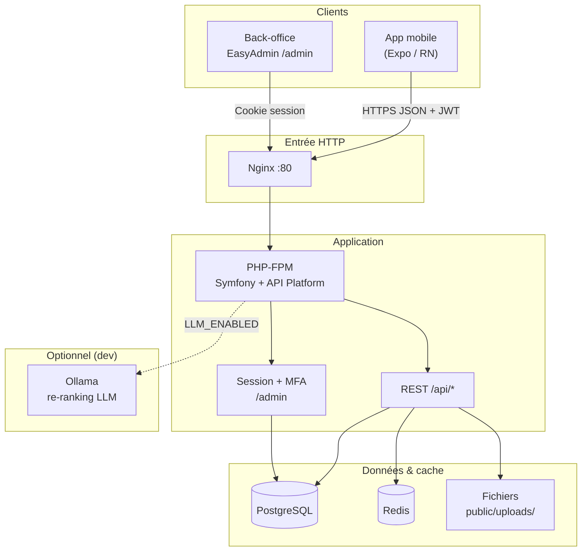
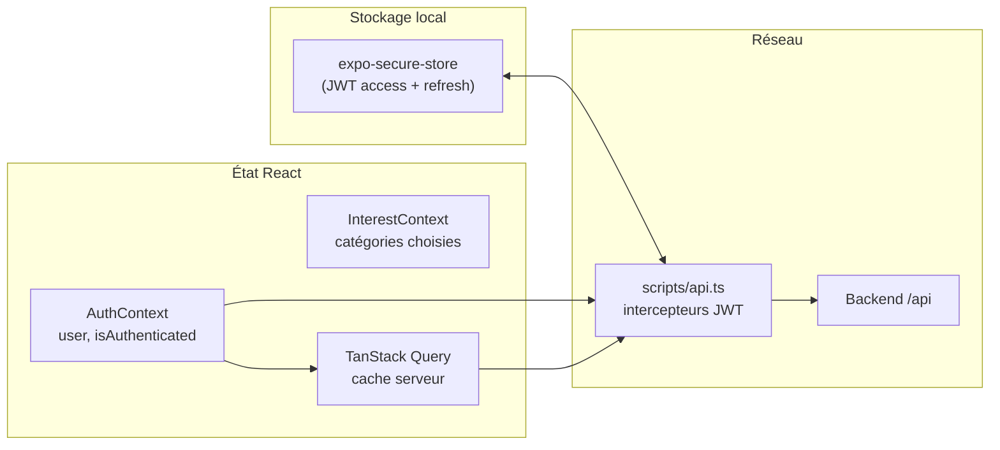
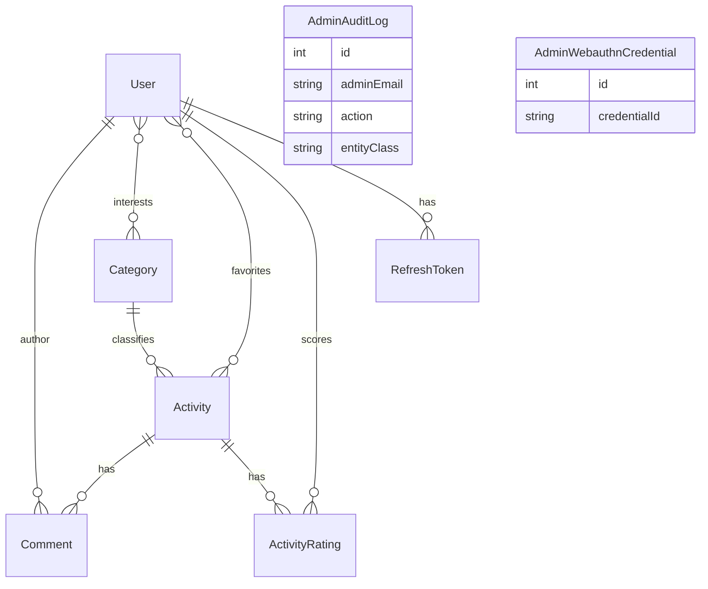
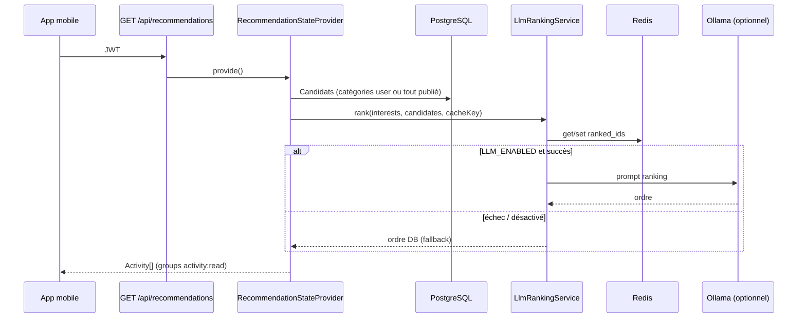

# Architecture ODOS — carte du projet & gestion des données

Document de référence pour comprendre la structure du dépôt, les flux applicatifs et le cycle de vie des données.  
Dernière mise à jour : **juin 2026**.

---

## 1. Vue d’ensemble

ODOS est une application de **découverte d’activités locales** composée de :

| Composant | Dossier | Stack |
|-----------|---------|--------|
| API & admin | `odos-back/` | Symfony 7, API Platform 4, Doctrine ORM, EasyAdmin 4 |
| Application mobile | `odos-front/` | Expo (React Native), Expo Router, TanStack Query |
| Orchestration locale | racine | Docker Compose (Postgres, Redis, Nginx, PHP, Ollama optionnel) |
| Documentation | `docs/` | RGPD, CI/CD, déploiement, exploitation |



---

## 2. Arborescence du dépôt

```
ODos/
├── odos-back/          # Backend Symfony
│   ├── src/
│   │   ├── Entity/           # Modèle Doctrine
│   │   ├── Repository/
│   │   ├── Controller/       # Routes custom (notes, commentaires, favoris, RGPD…)
│   │   ├── Controller/Admin/ # EasyAdmin CRUD + import CSV
│   │   ├── State/            # Providers / processors API Platform
│   │   ├── Service/          # Métier (LLM, import, throttle, suppression compte…)
│   │   ├── EventSubscriber/    # Audit admin, sécurité
│   │   └── Command/          # Cron rétention, purge tokens
│   ├── migrations/       # Schéma Postgres versionné
│   ├── config/           # packages, security, api_platform
│   ├── public/uploads/   # Avatars, photos activités
│   └── templates/      # Twig admin / MFA
├── odos-front/         # App Expo
│   ├── app/            # Expo Router (écrans)
│   ├── components/     # UI, carte MapLibre
│   ├── context/        # Auth, centres d’intérêt
│   ├── hooks/          # React Query (activités, favoris, recherche…)
│   ├── scripts/api.ts  # Client Axios + helpers REST
│   └── services/       # AuthService (login, inscription)
├── docs/               # Documentation projet
├── docker-compose.yml  # Stack dev
├── docker-compose.prod.yml
├── .github/workflows/  # CI + deploy Contabo
└── scripts/            # Utilitaires (purge prod, SIEM…)
```

---

## 3. Couches backend (`odos-back`)

### 3.1 Deux surfaces HTTP

| Surface | Authentification | Usage |
|---------|------------------|--------|
| **`/api/*`** | JWT stateless (Lexik) + refresh token (Gesdinet) | App mobile |
| **`/admin/*`** | Session Symfony + **MFA** (TOTP / SMS / WebAuthn) | Opérateurs |

La configuration des firewalls et `access_control` est dans `config/packages/security.yaml`.

### 3.2 API Platform vs contrôleurs dédiés

**Généré / déclaré via entités** (`#[ApiResource]`) :

- `Activity` — collection + item (`GET /api/activities`)
- `Category` — lecture publique
- `User` — inscription `POST`, profil `GET/PATCH`, `GET /api/me` via `MeStateProvider`
- `Activity` + opération custom — `GET /api/recommendations` via `RecommendationStateProvider`

**Routes Symfony dédiées** (logique métier, throttle, formats spécifiques) :

| Contrôleur | Routes |
|------------|--------|
| `FavoriteActivityController` | `POST/DELETE /api/activities/{id}/favorite` |
| `ActivityRatingController` | `GET/PUT/DELETE /api/activities/{id}/rating` |
| `ActivityCommentsController` | `GET/POST /api/activities/{id}/comments` |
| `CommentItemController` | `PATCH/DELETE /api/comments/{id}` |
| `UserAvatarController` | `POST/DELETE /api/me/avatar` (multipart) |
| `MeAccountController` | `GET /api/me/export`, `DELETE /api/me` (RGPD) |
| `ApiLogoutController` | `POST /api/logout` |
| `SocialConsentController` | `POST /api/social/consent` |
| `FriendshipController` | Amis : demandes, acceptation, refus |
| `UserSearchController` | `GET /api/users/search` (profils publics) |
| `UserBlockController` | `GET /api/users/blocked`, `POST/DELETE /api/users/{id}/block` |
| `UserProfileController` | `GET /api/users/{id}` (profil public) |
| `ChatController` | Conversations 1-to-1, messages (+ `activityId` / `parcoursId`) |
| `GroupController` | Groupes, membres, messages groupe |
| `GroupInvitationController` | Invitations groupe |
| `ForumThreadController` / `ForumReplyController` | Forum, likes |
| `ParcoursController` | CRUD parcours, étapes, cover, collaborateurs |
| `SocialUnreadCountController` | Compteurs non-lus social |

Formats API : JSON et JSON-LD (Hydra). Le mobile consomme surtout du JSON (`Accept: application/json`) et gère `hydra:member` pour les collections.

### 3.3 Services métier clés

| Service | Rôle |
|---------|------|
| `LlmRankingService` | Re-classe les candidats recommandations via Ollama (cache Redis) |
| `UserActionThrottleService` | Rate limit login, inscription, commentaires, notes |
| `CommentContentSanitizer` | Nettoyage XSS contenu commentaire |
| `UserDeletionService` | Effacement compte art. 17 (anonymisation commentaires, purge tokens) |
| `ActivityImportService` | Import CSV admin |
| `ActivityPhotoUploader` / avatar | Fichiers sur disque sous `public/uploads/` |
| `FriendshipService` | Amis, blocage, révocation collaborations parcours |
| `ChatService` | Messages privés, pièces jointes activité/parcours |
| `ParcoursService` | CRUD parcours, accès, cover, collaborateurs |
| `GroupChatService` | Messages groupe (+ attachments) |

### 3.4 State API Platform (`src/State/`)

| Classe | Rôle |
|--------|------|
| `MeStateProvider` | Profil courant enrichi pour `/api/me` |
| `RecommendationStateProvider` | Pipeline recommandations (DB → LLM → fallback) |
| `UserPasswordHasherProcessor` | Hash mot de passe à l’inscription / patch |
| `UserRegistrationProcessor` | Inscription publique (consentement CGU) |
| `UserRemoveProcessor` | Suppression / délégation vers `UserDeletionService` |

---

## 4. Application mobile (`odos-front`)

### 4.1 Navigation (Expo Router)

```
app/
├── _layout.tsx          # QueryClient, AuthProvider, InterestProvider
├── (tabs)/
│   ├── index.tsx        # Accueil (recommandations)
│   ├── search.tsx       # Recherche + carte
│   ├── parcours.tsx     # Bibliothèque parcours (onglet central)
│   ├── community/       # Forum | Amis | Messages | Groupes
│   └── account.tsx      # Compte (lien Favoris)
├── activity/[id].tsx    # Détail (note, commentaires, favori, parcours)
├── parcours/[id].tsx    # Détail parcours (carte, étapes, partage)
├── chat/[id].tsx        # Chat privé
├── group-chat/[id].tsx  # Chat de groupe
├── profile/[id].tsx     # Profil public, blocage
├── blocked-users.tsx    # Liste utilisateurs bloqués
├── map.tsx              # Expérience carte plein écran
├── login.tsx, settings.tsx, interests.tsx, legal.tsx
```

### 4.2 Gestion d’état côté client



| Couche | Fichiers | Responsabilité |
|--------|----------|----------------|
| **Session** | `context/AuthContext.tsx`, `services/AuthService.ts` | Login, `/api/me`, logout, purge cache au changement de compte |
| **Cache API** | `hooks/useActivities.ts`, `useFavorites.ts`, `useRecommendations.ts`, `useSearchActivities.ts`, `useParcours.ts`, `useChat.ts`, `useFriendships.ts`, `useBlocks.ts` | `queryKey` + `staleTime` par domaine |
| **HTTP** | `scripts/api.ts` | Base URL `EXPO_PUBLIC_API_URL`, refresh automatique sur 401 |
| **Erreurs** | `utils/errorHandling.ts` | Mapping HTTP → messages utilisateur (dont 429) |

Clés React Query fréquentes : `['activities']`, `['favoriteIds']`, `['activityRating', id]`, `['activityComments', id]`, `['recommendations']`.

### 4.3 Flux typiques mobile → API

**Connexion**

1. `POST /api/login` → `token` + `refresh_token`
2. Stockage SecureStore
3. `GET /api/me` → profil + favoris (IRIs ou objets)

**Écran détail activité** (requêtes parallèles)

1. `GET /api/activities/{id}`
2. `GET /api/activities/{id}/rating`
3. `GET /api/activities/{id}/comments?page=1`
4. `GET /api/me` (si connecté, pour état favori)

**Favoris** (pattern actuel)

1. `GET /api/activities?itemsPerPage=200` (cache global)
2. `GET /api/me` → extraction des IDs favoris
3. Filtre côté client dans `useFavorites`

**Recommandations**

1. `GET /api/recommendations` (auth obligatoire, `ROLE_USER`)

---

## 5. Modèle de données (PostgreSQL)

### 5.1 Diagramme entités



### 5.2 Tables principales

| Entité | Table | Rôle |
|--------|-------|------|
| `User` | `user` | Compte mobile (email, alias, bio, avatar, rôles, consentement CGU, `profilePublic`, consentement social) |
| `Category` | `category` | Taxonomie activités + centres d’intérêt |
| `Activity` | `activity` | Lieu, coords, prix, publication, agrégats `ratingAverage` / `ratingCount` |
| `Comment` | `comments` | Avis utilisateur ; soft hide (`isHidden`), édition (`isEdited`) |
| `ActivityRating` | `activity_rating` | Note 1–5 ; contrainte unique `(user_id, activity_id)` |
| `RefreshToken` | (bundle Gesdinet) | Refresh JWT |
| `AdminAuditLog` | `admin_audit_log` | Traçabilité actions admin |
| `AdminWebauthnCredential` | — | Clés WebAuthn MFA admin |
| `Friendship` | `friendship` | Demandes d’amis, statut (`Pending`, `Accepted`, `Blocked`, …) |
| `ChatConversation` / `ChatMessage` | `chat_*` | Messages privés (+ FK activité / parcours) |
| `ActivityGroup` / `GroupMessage` | `activity_group`, `group_message` | Groupes et fil (+ FK activité / parcours) |
| `ForumThread` / `ForumReply` | `forum_*` | Forum communautaire |
| `Parcours` / `ParcoursItem` / `ParcoursCollaborator` | `parcours*` | Itinéraires collaboratifs, visibilité, cover |

Tables de jointure implicites Doctrine :

- `user_interests` — `User` ↔ `Category`
- `user_favorites` — `User` ↔ `Activity`

### 5.3 Agrégats dénormalisés

Sur `Activity` :

- `ratingAverage`, `ratingCount` — mis à jour lors des `PUT/DELETE` sur `/rating` (évite de recalculer à chaque liste).

### 5.4 Données hors base

| Emplacement | Contenu | Cycle de vie |
|-------------|---------|--------------|
| `public/uploads/avatars/` | Avatars utilisateurs | Supprimé à l’effacement compte |
| `public/uploads/activities/` | Photos activités (import admin) | Lié à l’entité `Activity.imageUrl` |
| `public/uploads/parcours/` | Pochettes parcours | Lié à `Parcours.coverImageUrl` |
| Logs Nginx / Monolog | Accès, erreurs, audit | Voir `docs/LOG_RETENTION.md` |
| Cache Redis | Clés `llm_recommendations` | TTL `LLM_CACHE_TTL_SECONDS` (défaut 1800 s) |

---

## 6. Pipeline recommandations



Variables d’environnement : `LLM_PROVIDER`, `LLM_BASE_URL`, `LLM_MODEL`, `LLM_ENABLED`, `LLM_TOP_K`, `LLM_CANDIDATE_MAX`, `LLM_CACHE_TTL_SECONDS`.

---

## 7. Sécurité & conformité (transversal)

| Sujet | Implémentation |
|-------|----------------|
| Auth API | JWT + refresh ; routes publiques limitées (catalogue, lecture commentaires/notes) |
| Auth admin | Formulaire + MFA multi-méthode |
| Abus | `UserActionThrottleService` + réponses 429 |
| RGPD | Export `GET /api/me/export`, suppression `DELETE /api/me`, registre `docs/RGPD_registre.md` |
| Rétention | Commande `app:data-retention:purge` (refresh tokens + logs admin) |
| Audit admin | `AdminAuditSubscriber` → `AdminAuditLog` |
| Logs sensibles | `SensitiveDataProcessor` (Monolog) |

Détails juridiques et durées : **`docs/RGPD_registre.md`**, **`docs/LOG_RETENTION.md`**, **`docs/INCIDENT_RESPONSE.md`**.

---

## 8. Infrastructure & déploiement

### 8.1 Docker (développement)

| Service | Image / build | Port / rôle |
|---------|---------------|-------------|
| `postgres` | postgres:16-alpine | Données applicatives |
| `redis` | redis:7-alpine | Cache app + LLM |
| `php` | `odos-back/Dockerfile` (target dev) | Symfony |
| `nginx` | nginx:1.27-alpine | `:8000` → PHP-FPM |
| `llm` | ollama/ollama | `:11434` (profile dev) |

### 8.2 CI/CD

- **`/.github/workflows/ci.yml`** — PHPUnit, **PHPStan niveau 8**, lint/tests front, image Docker prod
- **`/.github/workflows/deploy-prod.yml`** — Déploiement Contabo (après CI sur `main`, si activé)

Voir **`docs/CI_CD_V2_2026.md`** et **`docs/PROD_SANS_DOMAINE.md`**.

### 8.3 Stack optionnelle

- **`docker-compose.wazuh.yml`** — SIEM / logs centralisés (optionnel)
- Script **`scripts/export-siem.ps1`**

---

## 9. Cartographie API REST (référence rapide)

| Méthode | Chemin | Auth | Données touchées |
|---------|--------|------|------------------|
| POST | `/api/login` | Public | — |
| POST | `/api/token/refresh` | Public | `RefreshToken` |
| POST | `/api/logout` | JWT | invalidation refresh |
| GET | `/api/me` | User | `User`, `favorites`, `interests` |
| GET | `/api/me/export` | User | export JSON RGPD |
| DELETE | `/api/me` | User | suppression / anonymisation |
| POST | `/api/users` | Public | création `User` |
| GET | `/api/categories` | Public | `Category` |
| GET | `/api/activities` | Public* | `Activity` (*brouillons masqués selon règles) |
| GET | `/api/recommendations` | User | `Activity` + cache LLM |
| POST/DELETE | `/api/activities/{id}/favorite` | User | table `user_favorites` |
| GET/PUT/DELETE | `/api/activities/{id}/rating` | GET public / write User | `ActivityRating`, agrégats |
| GET/POST | `/api/activities/{id}/comments` | GET public / POST User | `Comment` |
| PATCH/DELETE | `/api/comments/{id}` | User (auteur) | `Comment` |
| POST/DELETE | `/api/me/avatar` | User | fichier + `User.avatarUrl` |
| POST | `/api/social/consent` | User | `User.socialConsentedAt` |
| GET/POST/PATCH | `/api/friendships` | User | `Friendship` |
| GET | `/api/users/search` | User | recherche profils publics |
| POST/DELETE | `/api/users/{id}/block` | User | blocage + effets sociaux |
| GET/POST | `/api/chat/conversations/*` | User | `ChatConversation`, `ChatMessage` |
| GET/POST | `/api/groups/*` | User | groupes, messages |
| GET/POST | `/api/forum/*` | User | forum |
| GET/POST/PATCH/DELETE | `/api/parcours/*` | User | `Parcours`, items, cover, collaborateurs |

Admin : CRUD EasyAdmin sur les mêmes entités + import CSV + export logs.

---

## 10. Migrations & évolution du schéma

- Répertoire : **`odos-back/migrations/`**
- Commande : `php bin/console doctrine:migrations:migrate`
- En Docker : `docker compose exec php php bin/console doctrine:migrations:migrate`

Toute modification du modèle Doctrine doit passer par une migration versionnée avant prod.

---

## 11. Points d’attention (architecture actuelle)

Ces éléments ne sont pas des bugs documentés, mais des **choix à connaître** pour faire évoluer le système :

1. **Favoris** — le mobile charge tout le catalogue puis filtre ; un endpoint dédié (`/api/me/favorites`) réduirait bande passante et mémoire.
2. **Détail activité** — 3–4 requêtes REST parallèles ; un agrégat serveur ou un cache React Query partagé avec la liste limiterait la latence perçue.
3. **GraphQL** — non activé ; API Platform REST suffit à l’échelle actuelle (voir discussion projet).
4. **Double source admin / API** — EasyAdmin et API Platform partagent les entités ; les règles métier sensibles restent dans les services, pas uniquement dans les annotations.

---

## 12. Liens utiles

| Sujet | Document |
|-------|----------|
| Démarrage local | [README racine](../README.md) |
| Index documentation | [docs/README.md](README.md) |
| **Schémas Mermaid (tous)** | [ARCHITECTURE_MERMAID.md](ARCHITECTURE_MERMAID.md) |
| CI/CD | [CI_CD_V2_2026.md](CI_CD_V2_2026.md) |
| RGPD | [RGPD_registre.md](RGPD_registre.md) · [RGPD_AUDIT_2026.md](RGPD_AUDIT_2026.md) |
| Rétention données / logs | [LOG_RETENTION.md](LOG_RETENTION.md) |
| Plan LLM détaillé | [Document copy/planllm.md](../Document%20copy/planllm.md) |

---

*Pour toute évolution structurelle (nouvelle entité, nouveau flux RGPD, nouveau client), mettre à jour ce fichier et le registre RGPD si un traitement de données est ajouté.*
