# ODOS — Schémas d'architecture & base de données (Mermaid)

Document central regroupant **tous les diagrammes Mermaid** du projet : architecture applicative, flux métier, déploiement et **schéma PostgreSQL complet** (31 entités Doctrine + tables de jointure).

Dernière mise à jour : **juin 2026**.

> Référence textuelle détaillée : [ARCHITECTURE.md](ARCHITECTURE.md)

---

## Sommaire

1. [Vue d'ensemble système](#1-vue-densemble-système)
2. [Déploiement production](#2-déploiement-production)
3. [Couches backend](#3-couches-backend)
4. [Application mobile & web](#4-application-mobile--web)
5. [Authentification](#5-authentification)
6. [Pipeline recommandations](#6-pipeline-recommandations)
7. [Notifications push](#7-notifications-push)
8. [CI/CD](#8-cicd)
9. [Stack Wazuh (SIEM)](#9-stack-wazuh-siem)
10. [Base de données — vue globale](#10-base-de-données--vue-globale)
11. [Base de données — catalogue & utilisateurs](#11-base-de-données--catalogue--utilisateurs)
12. [Base de données — social & messagerie](#12-base-de-données--social--messagerie)
13. [Base de données — forum](#13-base-de-données--forum)
14. [Base de données — parcours](#14-base-de-données--parcours)
15. [Base de données — gamification & thèmes](#15-base-de-données--gamification--thèmes)
16. [Base de données — admin, auth & technique](#16-base-de-données--admin-auth--technique)
17. [Tables de jointure M2M](#17-tables-de-jointure-m2m)
18. [Inventaire complet des tables](#18-inventaire-complet-des-tables)

---

## 1. Vue d'ensemble système

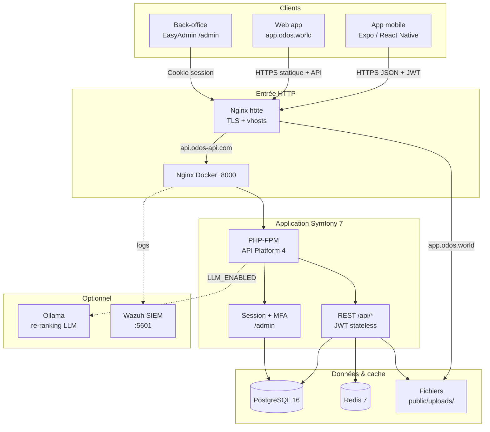

---

## 2. Déploiement production

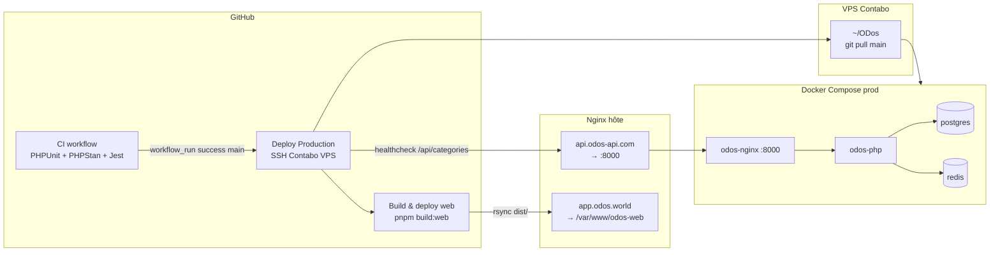

---

## 3. Couches backend

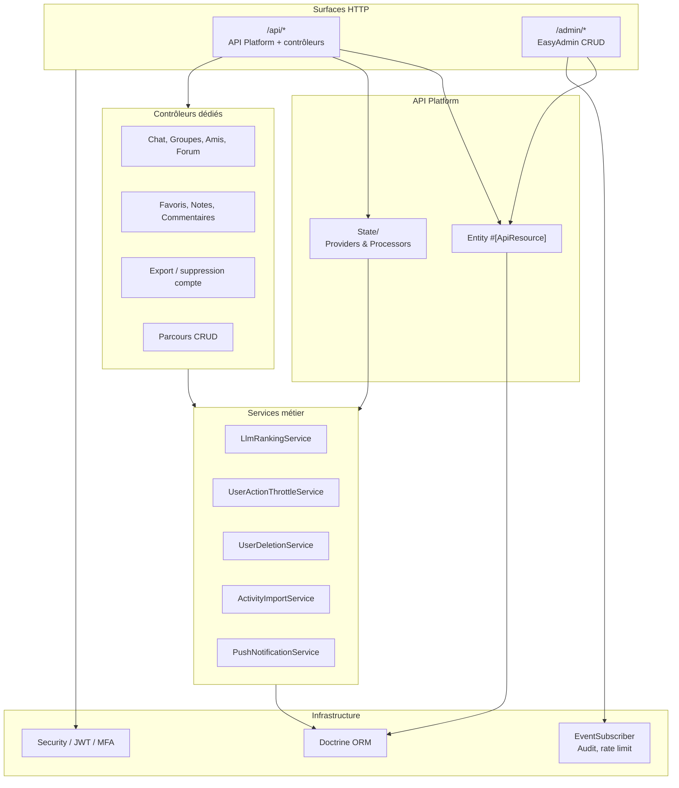

---

## 4. Application mobile & web

### 4.1 Navigation Expo Router

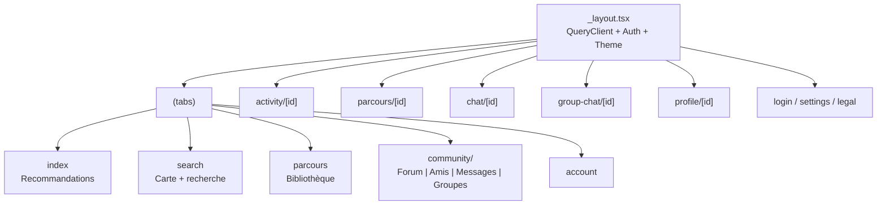

### 4.2 État client

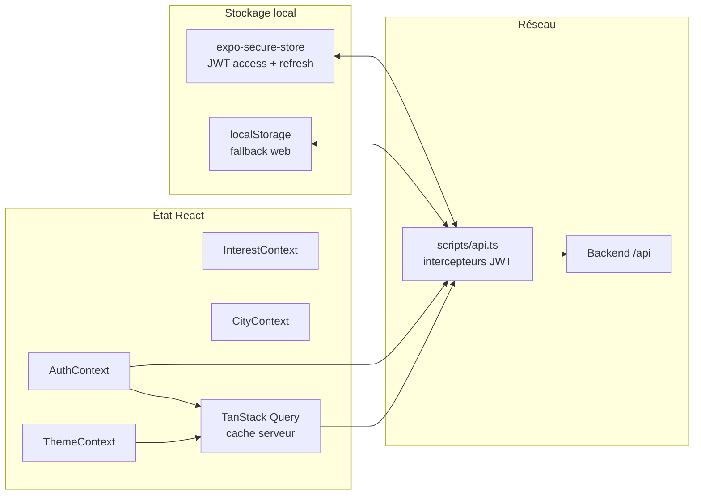

---

## 5. Authentification

### 5.1 API mobile (JWT)

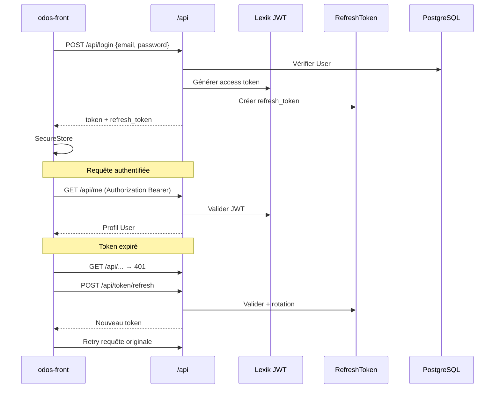

### 5.2 Admin (session + MFA)

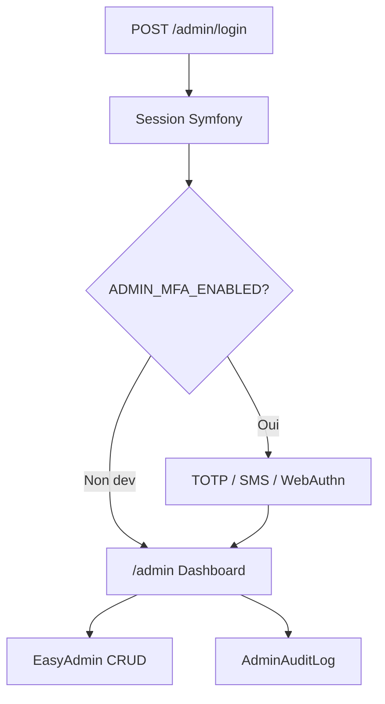

---

## 6. Pipeline recommandations

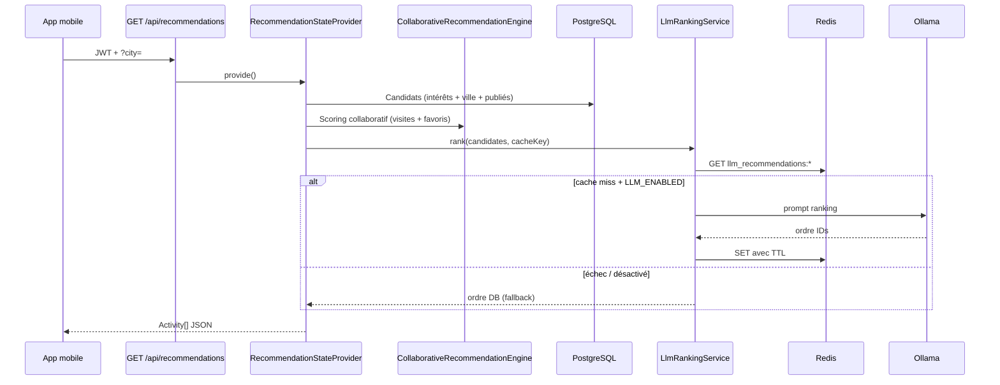

---

## 7. Notifications push

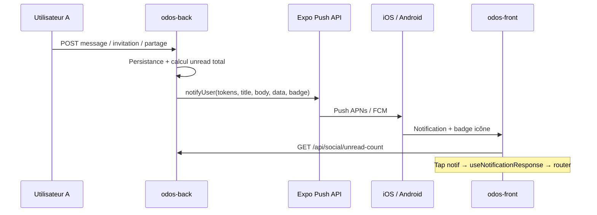

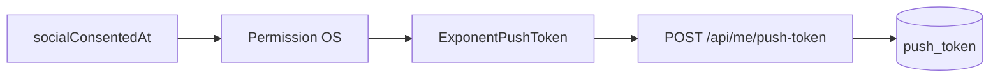

---

## 8. CI/CD

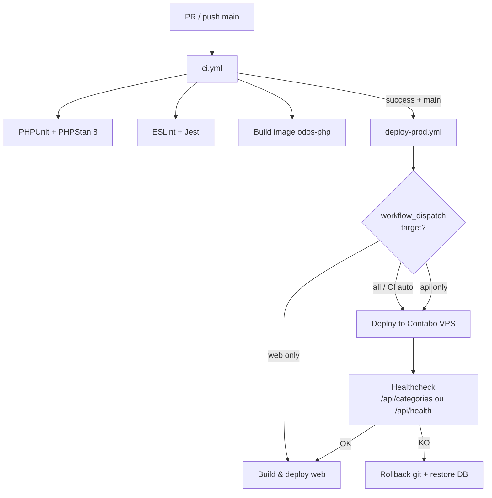

---

## 9. Stack Wazuh (SIEM)

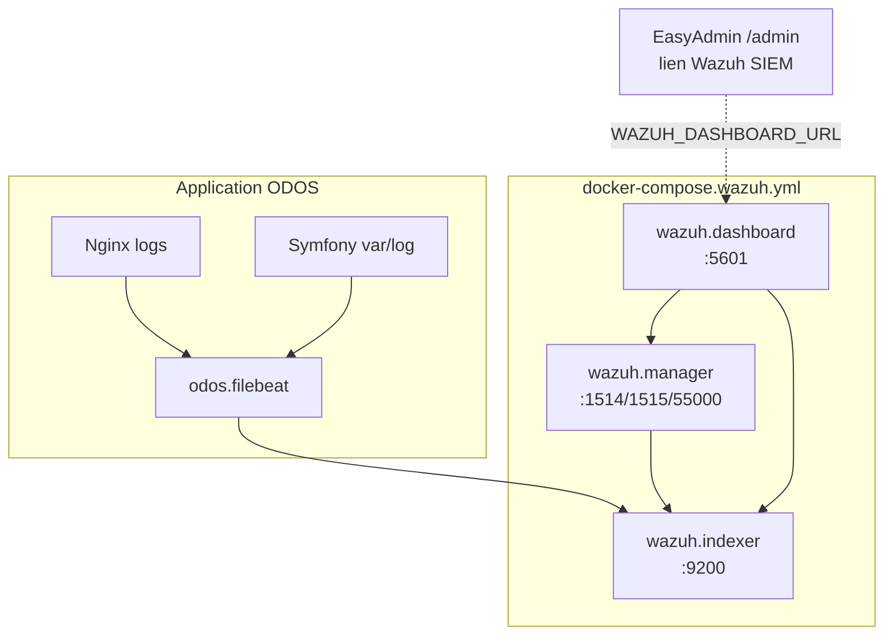

---

## 10. Base de données — vue globale

Relations entre les **31 entités** et **3 tables M2M** (sans colonnes — vue d'ensemble).

```mermaid
erDiagram
  User ||--o{ Comment : author
  User ||--o{ ActivityRating : scores
  User ||--o{ UserBadge : unlocks
  User ||--o{ UserBadgeDisplay : displays
  User ||--o{ AdminWebauthnCredential : mfa
  User ||--o{ PushToken : devices
  User ||--o{ UserActivityView : views
  User ||--o{ UserMapCell : exploration
  User }o--o{ Category : interests
  User }o--o{ Activity : favorites
  User }o--o{ Activity : visited

  Category ||--o{ Activity : classifies
  Activity ||--o{ Comment : has
  Activity ||--o{ ActivityRating : has
  Activity ||--o{ ParcoursItem : steps
  Activity ||--o{ UserActivityView : viewed

  User ||--o{ Friendship : sender
  User ||--o{ Friendship : receiver
  User ||--o{ Conversation : user_one
  User ||--o{ Conversation : user_two
  Conversation ||--o{ ChatMessage : messages
  User ||--o{ ChatMessage : author

  ActivityGroup ||--o{ GroupMember : members
  ActivityGroup ||--o{ GroupInvitation : invitations
  ActivityGroup ||--o{ GroupMessage : messages
  User ||--o{ GroupMember : member
  User ||--o{ GroupMessage : author

  User ||--o{ ForumThread : author
  ForumThread ||--o{ ForumReply : replies
  User ||--o{ ForumReply : author
  ForumReply ||--o{ ForumReplyLike : likes
  User ||--o{ ForumReplyLike : likes

  User ||--o{ Parcours : owner
  Parcours ||--o{ ParcoursItem : items
  Parcours ||--o{ ParcoursCollaborator : collaborators

  BadgeDefinition ||--o{ UserBadge : definition
  BadgeDefinition ||--o{ UserBadgeDisplay : definition

  User ||--o{ ContentReport : reporter
  User ||--o{ ForumReport : reporter
  User ||--o{ SharedActivity : sender
```

---

## 11. Base de données — catalogue & utilisateurs

```mermaid
erDiagram
  user {
    int id PK
    string email UK "180, NOT NULL"
    datetime_immutable consented_at "nullable"
    string phone_number "32, nullable"
    string alias UK "60, nullable"
    string avatar_url "512, nullable"
    text bio "nullable, max 500"
    string home_city "255, nullable"
    json roles "NOT NULL"
    string password "255, NOT NULL"
    string google_id UK "255, nullable"
    string apple_id UK "255, nullable"
    string password_reset_token_hash "64, nullable"
    datetime_immutable password_reset_expires_at "nullable"
    boolean hide_badges_on_profile "default false"
    datetime_immutable map_exploration_consent_at "nullable"
    boolean map_exploration_enabled "default false"
    boolean profile_public "default true"
    datetime_immutable social_consented_at "nullable"
    boolean is_forum_banned "default false"
  }

  category {
    int id PK
    string name "255, NOT NULL"
  }

  activity {
    int id PK
    string name "255, NOT NULL"
    text description "NOT NULL"
    float latitude "NOT NULL"
    float longitude "NOT NULL"
    string city "255, nullable"
    float price "nullable"
    string image_url "512, nullable"
    datetime date_start "nullable"
    datetime date_end "nullable"
    boolean is_published "default true"
    decimal rating_average "4,2, nullable"
    int rating_count "default 0"
    int category_id FK "NOT NULL"
  }

  comments {
    int id PK
    text content "NOT NULL"
    datetime_immutable created_at "NOT NULL"
    datetime_immutable updated_at "NOT NULL"
    boolean is_edited "default false"
    boolean is_hidden "default false"
    int author_id FK "nullable, SET NULL"
    int activity_id FK "NOT NULL, CASCADE"
  }

  activity_rating {
    int id PK
    int score "1-5, NOT NULL"
    datetime_immutable created_at "NOT NULL"
    datetime_immutable updated_at "NOT NULL"
    int user_id FK "NOT NULL, CASCADE"
    int activity_id FK "NOT NULL, CASCADE"
    string UK "uniq_user_activity_rating"
  }

  user_activity_view {
    int id PK
    datetime_immutable first_viewed_at "NOT NULL"
    datetime_immutable last_viewed_at "NOT NULL"
    int user_id FK "NOT NULL, CASCADE"
    int activity_id FK "NOT NULL, CASCADE"
    string UK "uniq_user_activity_view"
  }

  user_map_cell {
    int id PK
    string cell_id "16, geohash, NOT NULL"
    string zone_key "32, default catalog-v1"
    datetime_immutable first_visited_at "NOT NULL"
    datetime_immutable last_visited_at "NOT NULL"
    int user_id FK "NOT NULL, CASCADE"
    string UK "uniq_user_map_cell"
  }

  user }o--o{ category : "user_category"
  user }o--o{ activity : "user_favorite_activity"
  user }o--o{ activity : "user_visited_activity"
  category ||--o{ activity : category_id
  user ||--o{ comments : author_id
  activity ||--o{ comments : activity_id
  user ||--o{ activity_rating : user_id
  activity ||--o{ activity_rating : activity_id
  user ||--o{ user_activity_view : user_id
  activity ||--o{ user_activity_view : activity_id
  user ||--o{ user_map_cell : user_id
```

---

## 12. Base de données — social & messagerie

```mermaid
erDiagram
  friendship {
    int id PK
    string status "FriendshipStatus, default pending"
    datetime_immutable created_at "NOT NULL"
    datetime_immutable accepted_at "nullable"
    int sender_id FK "NOT NULL, CASCADE"
    int receiver_id FK "NOT NULL, CASCADE"
  }

  conversation {
    int id PK
    datetime_immutable last_message_at "nullable"
    datetime_immutable created_at "NOT NULL"
    int user_one_id FK "NOT NULL, CASCADE"
    int user_two_id FK "NOT NULL, CASCADE"
    string UK "uniq_conversation_pair"
  }

  chat_message {
    int id PK
    text content "NOT NULL"
    datetime_immutable read_at "nullable"
    datetime_immutable created_at "NOT NULL"
    int conversation_id FK "NOT NULL, CASCADE"
    int author_id FK "NOT NULL, CASCADE"
    int activity_id FK "nullable, SET NULL"
    int parcours_id FK "nullable, SET NULL"
  }

  activity_group {
    int id PK
    string name "100, NOT NULL"
    string description "500, nullable"
    string avatar_url "500, nullable"
    boolean is_private "default false"
    int member_count "default 1"
    datetime_immutable created_at "NOT NULL"
    int created_by_id FK "nullable, SET NULL"
  }

  group_member {
    int id PK
    string role "GroupRole, default member"
    datetime_immutable joined_at "NOT NULL"
    datetime_immutable last_read_group_message_at "nullable"
    int group_id FK "NOT NULL, CASCADE"
    int user_id FK "NOT NULL, CASCADE"
    string UK "uniq_group_member"
  }

  group_invitation {
    int id PK
    string status "GroupInvitationStatus, default pending"
    datetime_immutable created_at "NOT NULL"
    int group_id FK "NOT NULL, CASCADE"
    int invitee_id FK "NOT NULL, CASCADE"
    int invited_by_id FK "NOT NULL, CASCADE"
    string UK "uniq_group_invitee_pending"
  }

  group_message {
    int id PK
    text content "NOT NULL"
    datetime_immutable created_at "NOT NULL"
    int group_id FK "NOT NULL, CASCADE"
    int author_id FK "NOT NULL, CASCADE"
    int activity_id FK "nullable, SET NULL"
    int parcours_id FK "nullable, SET NULL"
  }

  shared_activity {
    int id PK
    string message "280, nullable"
    datetime_immutable created_at "NOT NULL"
    datetime_immutable seen_at "nullable"
    int sender_id FK "NOT NULL, CASCADE"
    int receiver_id FK "nullable, CASCADE"
    int group_id FK "nullable, CASCADE"
    int activity_id FK "NOT NULL, CASCADE"
  }

  content_report {
    int id PK
    string target_type "ContentReportTargetType"
    int target_id "NOT NULL"
    string reason "ForumReportReason"
    text details "nullable"
    string status "ForumReportStatus, default pending"
    datetime_immutable created_at "NOT NULL"
    int reporter_id FK "NOT NULL, CASCADE"
    int chat_message_id FK "nullable, SET NULL"
    int group_message_id FK "nullable, SET NULL"
    int comment_id FK "nullable, SET NULL"
    int reported_user_id FK "nullable, SET NULL"
    string UK "uniq_content_report_reporter_target"
  }

  user ||--o{ friendship : sender_id
  user ||--o{ friendship : receiver_id
  user ||--o{ conversation : user_one_id
  user ||--o{ conversation : user_two_id
  conversation ||--o{ chat_message : conversation_id
  user ||--o{ chat_message : author_id
  activity_group ||--o{ group_member : group_id
  user ||--o{ group_member : user_id
  activity_group ||--o{ group_invitation : group_id
  user ||--o{ group_invitation : invitee_id
  user ||--o{ group_invitation : invited_by_id
  activity_group ||--o{ group_message : group_id
  user ||--o{ group_message : author_id
  user ||--o{ shared_activity : sender_id
  user ||--o{ shared_activity : receiver_id
  activity_group ||--o{ shared_activity : group_id
  activity ||--o{ shared_activity : activity_id
  user ||--o{ content_report : reporter_id
```

---

## 13. Base de données — forum

```mermaid
erDiagram
  forum_thread {
    int id PK
    string title "200, NOT NULL"
    text content "NOT NULL"
    boolean is_pinned "default false"
    boolean is_locked "default false"
    int reply_count "default 0"
    datetime_immutable last_reply_at "nullable"
    datetime_immutable created_at "NOT NULL"
    int author_id FK "nullable, SET NULL"
    int activity_id FK "nullable, CASCADE"
    int category_id FK "nullable, SET NULL"
    int group_id FK "nullable, CASCADE"
  }

  forum_reply {
    int id PK
    text content "NOT NULL"
    boolean is_hidden "default false"
    int like_count "default 0"
    datetime_immutable created_at "NOT NULL"
    int author_id FK "nullable, SET NULL"
    int thread_id FK "NOT NULL, CASCADE"
  }

  forum_reply_like {
    int user_id PK_FK "NOT NULL, CASCADE"
    int reply_id PK_FK "NOT NULL, CASCADE"
    datetime_immutable created_at "NOT NULL"
  }

  forum_report {
    int id PK
    string target_type "ForumReportTargetType"
    int target_id "NOT NULL"
    string reason "ForumReportReason"
    text details "nullable"
    string status "ForumReportStatus, default pending"
    datetime_immutable created_at "NOT NULL"
    int reporter_id FK "NOT NULL, CASCADE"
    int thread_id FK "nullable, SET NULL"
    int reply_id FK "nullable, SET NULL"
    string UK "uniq_forum_report_reporter_target"
  }

  forum_thread ||--o{ forum_reply : thread_id
  user ||--o{ forum_thread : author_id
  user ||--o{ forum_reply : author_id
  forum_reply ||--o{ forum_reply_like : reply_id
  user ||--o{ forum_reply_like : user_id
  user ||--o{ forum_report : reporter_id
  activity ||--o{ forum_thread : activity_id
  category ||--o{ forum_thread : category_id
  activity_group ||--o{ forum_thread : group_id
```

---

## 14. Base de données — parcours

```mermaid
erDiagram
  parcours {
    int id PK
    string title "120, NOT NULL"
    string description "500, nullable"
    string cover_image_url "500, nullable"
    string visibility "ParcoursVisibility, default private"
    int item_count "default 0"
    datetime_immutable created_at "NOT NULL"
    datetime_immutable updated_at "NOT NULL"
    int owner_id FK "nullable, SET NULL"
  }

  parcours_item {
    int id PK
    int position "default 0"
    string note "280, nullable"
    int parcours_id FK "NOT NULL, CASCADE"
    int activity_id FK "NOT NULL, CASCADE"
  }

  parcours_collaborator {
    int id PK
    datetime_immutable added_at "NOT NULL"
    int parcours_id FK "NOT NULL, CASCADE"
    int user_id FK "NOT NULL, CASCADE"
    string UK "uniq_parcours_collaborator"
  }

  user ||--o{ parcours : owner_id
  parcours ||--o{ parcours_item : parcours_id
  activity ||--o{ parcours_item : activity_id
  parcours ||--o{ parcours_collaborator : parcours_id
  user ||--o{ parcours_collaborator : user_id
  parcours ||--o{ chat_message : parcours_id
  parcours ||--o{ group_message : parcours_id
```

---

## 15. Base de données — gamification & thèmes

```mermaid
erDiagram
  badge_definition {
    int id PK
    string code UK "64, NOT NULL"
    string name "120, NOT NULL"
    text description "NOT NULL"
    string image_url "512, nullable"
    int sort_order "default 0"
    boolean is_active "default true"
    boolean is_hidden_by_default "default false"
    string rule_type "BadgeRuleType, 32"
    json rule_config "nullable"
    datetime_immutable created_at "NOT NULL"
    datetime_immutable updated_at "NOT NULL"
  }

  user_badge {
    int id PK
    datetime_immutable unlocked_at "NOT NULL"
    datetime_immutable seen_at "nullable"
    int user_id FK "NOT NULL, CASCADE"
    int badge_id FK "NOT NULL, CASCADE"
    string UK "uniq_user_badge"
  }

  user_badge_display {
    int id PK
    boolean is_displayed_on_profile "default true"
    int display_order "nullable"
    int user_id FK "NOT NULL, CASCADE"
    int badge_id FK "NOT NULL, CASCADE"
    string UK "uniq_user_badge_display"
  }

  app_theme {
    int id PK
    string slug UK "64, NOT NULL"
    string label "128, NOT NULL"
    string description "255, nullable"
    boolean is_active "NOT NULL"
    int sort_order "NOT NULL"
    json light_palette "nullable"
    json dark_palette "nullable"
  }

  badge_definition ||--o{ user_badge : badge_id
  user ||--o{ user_badge : user_id
  badge_definition ||--o{ user_badge_display : badge_id
  user ||--o{ user_badge_display : user_id
```

---

## 16. Base de données — admin, auth & technique

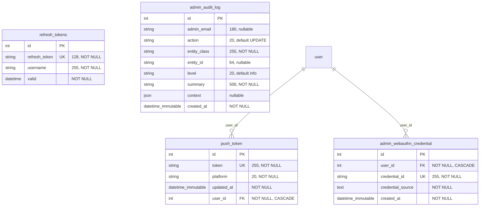

---

## 17. Tables de jointure M2M

Pas d'entité Doctrine dédiée — gérées par `User`.

```mermaid
erDiagram
  user_category {
    int user_id PK_FK "→ user.id"
    int category_id PK_FK "→ category.id"
  }

  user_favorite_activity {
    int user_id PK_FK "→ user.id"
    int activity_id PK_FK "→ activity.id"
  }

  user_visited_activity {
    int user_id PK_FK "→ user.id"
    int activity_id PK_FK "→ activity.id"
  }

  user ||--o{ user_category : user_id
  category ||--o{ user_category : category_id
  user ||--o{ user_favorite_activity : user_id
  activity ||--o{ user_favorite_activity : activity_id
  user ||--o{ user_visited_activity : user_id
  activity ||--o{ user_visited_activity : activity_id
```

---

## 18. Inventaire complet des tables

| # | Table PostgreSQL | Entité PHP | Clé primaire | Contraintes uniques notables |
|---|------------------|------------|--------------|------------------------------|
| 1 | `user` | `User` | `id` | `email`, `alias`, `google_id`, `apple_id` |
| 2 | `category` | `Category` | `id` | — |
| 3 | `activity` | `Activity` | `id` | — |
| 4 | `comments` | `Comment` | `id` | — |
| 5 | `activity_rating` | `ActivityRating` | `id` | `(user_id, activity_id)` |
| 6 | `user_category` | M2M | `(user_id, category_id)` | composite |
| 7 | `user_favorite_activity` | M2M | `(user_id, activity_id)` | composite |
| 8 | `user_visited_activity` | M2M | `(user_id, activity_id)` | composite |
| 9 | `user_activity_view` | `UserActivityView` | `id` | `(user_id, activity_id)` |
| 10 | `user_map_cell` | `UserMapCell` | `id` | `(user_id, cell_id)` |
| 11 | `friendship` | `Friendship` | `id` | — |
| 12 | `conversation` | `Conversation` | `id` | `(user_one_id, user_two_id)` |
| 13 | `chat_message` | `ChatMessage` | `id` | — |
| 14 | `activity_group` | `ActivityGroup` | `id` | — |
| 15 | `group_member` | `GroupMember` | `id` | `(group_id, user_id)` |
| 16 | `group_invitation` | `GroupInvitation` | `id` | `(group_id, invitee_id)` |
| 17 | `group_message` | `GroupMessage` | `id` | — |
| 18 | `shared_activity` | `SharedActivity` | `id` | — |
| 19 | `content_report` | `ContentReport` | `id` | `(reporter_id, target_type, target_id)` |
| 20 | `forum_thread` | `ForumThread` | `id` | — |
| 21 | `forum_reply` | `ForumReply` | `id` | — |
| 22 | `forum_reply_like` | `ForumReplyLike` | `(user_id, reply_id)` | composite PK |
| 23 | `forum_report` | `ForumReport` | `id` | `(reporter_id, target_type, target_id)` |
| 24 | `parcours` | `Parcours` | `id` | — |
| 25 | `parcours_item` | `ParcoursItem` | `id` | — |
| 26 | `parcours_collaborator` | `ParcoursCollaborator` | `id` | `(parcours_id, user_id)` |
| 27 | `badge_definition` | `BadgeDefinition` | `id` | `code` |
| 28 | `user_badge` | `UserBadge` | `id` | `(user_id, badge_id)` |
| 29 | `user_badge_display` | `UserBadgeDisplay` | `id` | `(user_id, badge_id)` |
| 30 | `app_theme` | `AppTheme` | `id` | `slug` |
| 31 | `push_token` | `PushToken` | `id` | `token` |
| 32 | `refresh_tokens` | `RefreshToken` | `id` | `refresh_token` |
| 33 | `admin_audit_log` | `AdminAuditLog` | `id` | — |
| 34 | `admin_webauthn_credential` | `AdminWebauthnCredential` | `id` | `credential_id` |

**Total : 34 tables** (31 entités + 3 jointures M2M).

### Fichiers hors base

| Emplacement | Lié à |
|-------------|-------|
| `public/uploads/avatars/` | `user.avatar_url` |
| `public/uploads/activities/` | `activity.image_url` |
| `public/uploads/badges/` | `badge_definition.image_url` |
| `public/uploads/parcours/` | `parcours.cover_image_url` |
| Redis `llm_recommendations:*` | Cache LLM (TTL configurable) |

### Migrations

Répertoire : `odos-back/migrations/` — toute évolution du schéma passe par `doctrine:migrations:diff` puis `migrate`.

---

## Rendu des diagrammes

- **GitHub** : prévisualisation native des blocs ` ```mermaid ` dans les fichiers `.md`
- **VS Code / Cursor** : extension « Markdown Preview Mermaid Support »
- **Export PNG/SVG** : [mermaid.live](https://mermaid.live) — coller un bloc diagramme

---

*Pour toute nouvelle entité ou flux, mettre à jour ce fichier en parallèle de [ARCHITECTURE.md](ARCHITECTURE.md).*
