# Dossier de Projet
## Titre Professionnel CDA (niveau 6)
### Concepteur Développeur d'Applications

**Candidat :** Manuel  
**Projet :** ODOS, application mobile & web de découverte d'activités locales  
**Date :** Juin 2026 (mise à jour : 28 juin 2026)  
**Code titre :** TP-01281, millésime 04

> Tous les diagrammes (architecture, flux, base de données) sont regroupés dans [ARCHITECTURE_MERMAID.md](ARCHITECTURE_MERMAID.md).

---

## Table des matières

0. [Identité visuelle](#0-identité-visuelle)  
1. [Liste des compétences mises en œuvre](#1-liste-des-compétences-mises-en-œuvre)  
2. [Cahier des charges](#2-cahier-des-charges)  
3. [Gestion du projet](#3-gestion-du-projet)  
4. [Spécifications fonctionnelles](#4-spécifications-fonctionnelles)  
5. [Contraintes et livrables](#5-contraintes-et-livrables)  
6. [Architecture logicielle](#6-architecture-logicielle)  
   - 6.5 [Algorithme de recommandation](#65-algorithme-de-recommandation)  
   - 6.6 [Système de parcours collaboratifs](#66-système-de-parcours-collaboratifs)  
   - 6.7 [Modularité et extensibilité](#67-modularité-et-extensibilité)  
7. [Maquettes et enchaînement](#7-maquettes-et-enchaînement)  
8. [Modèle de données](#8-modèle-de-données)  
9. [Scripts SQL](#9-scripts-sql)  
10. [Diagrammes de cas d'utilisation](#10-diagrammes-de-cas-dutilisation)  
11. [Diagrammes de séquence](#11-diagrammes-de-séquence)  
12. [Spécifications techniques et sécurité](#12-spécifications-techniques-et-sécurité)  
13. [Extraits de code significatifs](#13-extraits-de-code-significatifs)  
14. [Annexes](#14-annexes)

---

## 0. Identité visuelle

### 0.1 Logo et icônes

Le logo ODOS, c'est un **« O » stylisé** : une ellipse avec un tracé intérieur. Je l'ai codé en SVG (`AppLogo.tsx`) pour qu'il suive le thème de l'app : couleur d'accent à l'extérieur, contraste à l'intérieur, en clair comme en sombre.

| Asset | Fichier | Usage |
|-------|---------|--------|
| Logo vectoriel (composant) | `odos-front/components/AppLogo.tsx` | Splash, login, écrans d'accueil |
| Icône application | `odos-front/assets/images/icon.png` | Android / iOS / stores |
| Splash | `odos-front/assets/images/splash-icon.png` | Écran de démarrage Expo |
| Favicon web | `odos-front/assets/images/favicon.png` | `app.odos.world` |


*Figure 0.1. Icône application (`icon.png`).*


*Figure 0.2. Icône splash.*

Si les images ne s'affichent pas dans le PDF ou le preview, les fichiers sont dans `odos-front/assets/images/`. On peut aussi voir le logo en lançant l'app (composant `<AppLogo />`).

### 0.2 Palette et thèmes dynamiques

Au départ les couleurs étaient en dur dans le code. Aujourd'hui je peux en ajouter depuis le back-office : chaque thème (`AppTheme`) embarque une palette claire et une palette sombre en JSON. L'app les charge via `GET /api/themes`. En secours, des palettes locales restent dans `odos-front/constants/themes/`.

---

## 1. Liste des compétences mises en œuvre

Le projet ODOS couvre les compétences du référentiel CDA (arrêté du 26/04/2023), réparties sur les trois certificats ci-dessous.

### CCP 1 : Développer une application sécurisée

| Compétence | Mise en œuvre dans ODOS |
|-----------|------------------------|
| Développer des interfaces utilisateur | Écrans React Native / Expo Router : accueil, carte, recherche, favoris, compte, activité, paramètres, légal |
| Développer des composants métier | `CollaborativeRecommendationEngine`, `LlmRankingService`, `ParcoursService`, `GamificationProfileService`, `PushNotificationService`, `CommentContentSanitizer` |
| Contribuer à la gestion d'un projet informatique | Tickets Git, CI/CD GitHub Actions, migrations Doctrine versionnées |
| Analyser les besoins et maquetter une application | Analyse fonctionnelle, maquettes fil-de-fer des 6 écrans principaux |
| Définir l'architecture logicielle d'une application | Architecture hexagonale backend (Symfony), navigation par fichiers frontend (Expo Router) |
| Concevoir et mettre en place une base de données relationnelle | Schéma PostgreSQL 16, **31 entités Doctrine**, **34 tables** (dont 3 M2M), migrations versionnées |
| Développer des composants d'accès aux données SQL | `ActivityRepository::findRecommendationCandidates()`, `findCoEngagedActivityIds()` |
| Préparer et exécuter les plans de tests | PHPUnit 11 (tests unitaires sans DB), Jest / Testing Library (React Native) |

### CCP 2 : Concevoir et développer une application sécurisée organisée en couches

| Compétence | Mise en œuvre dans ODOS |
|-----------|------------------------|
| Installer et configurer son environnement | Docker Compose (Nginx, PHP-FPM, PostgreSQL, Redis, Ollama), EAS Build (Expo) |
| Interfaces métier | Composants `FavoriteCard`, `MapExperience`, `ActivityCommentsSection`, `CTAButton`, `BlobFrame` |
| Analyser les besoins et maquetter une application | API design REST + JSON-LD (API Platform 4) |
| Définir l'architecture logicielle d'une application | Isolation `RecommendationEngineInterface`, `ParcoursService`, thèmes dynamiques, split web/natif (Metro) |
| Concevoir et mettre en place une base de données SQL et NoSQL | PostgreSQL (SQL) + Redis (cache LLM) |
| Développer des composants d'accès aux données SQL | ORM Doctrine, `ActivityRepository`, `CommentRepository` |
| Préparer et exécuter les plans de tests d'une application | 8 tests unitaires recommandation, 70 % de couverture Jest frontend |
| Préparer et documenter le déploiement DevOps | Docker Compose multi-profils, `.env.example`, GitHub Actions CI, EAS Build Android/iOS |
| Contribuer à la mise en production dans une démarche DevOps | Pipeline CI/CD : lint + tests backend + frontend à chaque PR |

### CCP 3 : Préparer le déploiement d'une application sécurisée

| Compétence | Mise en œuvre dans ODOS |
|-----------|------------------------|
| Préparer le déploiement | `docker-compose.yml`, `docker-compose.override.yml`, scripts de migration, `.env.example` documenté |
| Sécurité applicative | JWT (Lexik, 15 min), refresh tokens (Gesdinet, 30 j), rate limiting (Symfony RateLimiter), argon2id mots de passe, CORS restreint, HTTPS |
| Analyse de vulnérabilités | PHPStan niveau 8, audit OWASP OTOS-10 intégré à la conception |

---

## 2. Cahier des charges

### 2.1 Présentation du contexte

ODOS, c'est une app **mobile et web** pour découvrir des activités près de chez soi : culture, sport, sorties. L'idée : on indique une fois ce qui nous intéresse et sa ville, on reçoit des propositions qu'on n'aurait pas forcément cherchées. On peut aussi composer des **parcours** (plusieurs étapes), discuter avec d'autres utilisateurs, et affiner les suggestions grâce à ce que font les gens aux goûts proches.

**Le problème visé :** sur Google Maps ou Eventbrite, il faut déjà savoir quoi taper. Ici c'est l'inverse : l'app propose, l'utilisateur explore.

### 2.2 Objectifs

| Priorité | Objectif |
|---------|---------|
| Must | Inscription / connexion JWT sécurisée |
| Must | Catalogue d'activités filtrables par catégorie, position et prix |
| Must | Recommandations personnalisées basées sur les intérêts |
| Must | Carte interactive (MapLibre) avec clusters d'activités |
| Must | Système de favoris (toggle) |
| Must | Notes (1-5 étoiles) et commentaires par activité |
| Must | Back-office EasyAdmin avec MFA pour les opérateurs |
| Should | Bouton « J'ai visité ce lieu » alimentant le collaborative filtering |
| Should | Algorithme de recommandation avec filtrage collaboratif |
| Should | Re-ranking par LLM local (Ollama) |
| Should | Export des données personnelles en PDF (art. 20 RGPD) |
| Must | Système de **parcours** collaboratifs (étapes, cover, visibilité publique/privée) |
| Must | **Communauté** : amis, chat privé, groupes, forum, partage d'activités |
| Should | Filtrage des recommandations par **ville** (`homeCity` + sélecteur) |
| Should | **Thèmes** applicatifs dynamiques (palettes admin → mobile/web) |
| Should | **Web app** responsive sur `app.odos.world` (react-native-web) |
| Should | Notifications **push** (Expo) pour messages, invitations, partages |
| Could | Gamification : badges, exploration carte GPS, vitrine profil |
| Could | Connexion sociale Google / Apple |
| Could | Stack **Wazuh** SIEM (logs centralisés, lien depuis le back-office) |

### 2.3 Périmètre fonctionnel

L'application comprend **trois surfaces** :

- **`/api/*`** : API REST JSON stateless (mobile + web), sécurisée par JWT.
- **`/admin/*`** : Back-office EasyAdmin, session + MFA (TOTP, SMS, WebAuthn).
- **`app.odos.world`** : Web app statique (Expo export web), même codebase que le mobile.

### 2.4 Acteurs

| Acteur | Droits |
|-------|-------|
| Visiteur (non connecté) | Consultation du catalogue, recherche géographique |
| Utilisateur connecté | Favoris, visites, notes, commentaires, recommandations, export données, suppression compte |
| Opérateur (admin) | Gestion CRUD activités/catégories/badges, modération commentaires, statistiques |

### 2.5 Contraintes non-fonctionnelles

- **Performance :** API < 300 ms p95 (recommandations avec cache LLM Redis)
- **Sécurité :** OWASP Top 10, pas de données sensibles dans les logs (Monolog `SensitiveDataProcessor`)
- **RGPD :** Export art. 20, effacement art. 17, registre art. 30, consentement explicite
- **Disponibilité :** conteneurs Docker, reprise de service < 2 min
- **Scalabilité :** remplacement du moteur de recommandation sans toucher à la couche API (interface)

---

## 3. Gestion du projet

### 3.1 Environnement humain

Le projet a été développé en solo (développeur full-stack) avec :

- **Outils de suivi :** Git (branches par fonctionnalité, commits conventionnels), GitHub Issues
- **Méthodologie :** Kanban : colonnes Backlog / In Progress / Review / Done
- **Revue de code :** auto-revue assistée par analyse statique (PHPStan L8, ESLint)
- **CI/CD :** GitHub Actions : tests + lint à chaque PR, build APK EAS à chaque tag

### 3.2 Planning synthétique

| Phase | Durée estimée | Livrables |
|-------|-------------|---------|
| Analyse & maquettes | 2 semaines | Spécifications fonctionnelles, wireframes |
| Infrastructure & auth | 1 semaine | Docker Compose, JWT, inscription/connexion |
| Catalogue & carte | 2 semaines | API activités, MapLibre, recherche |
| Recommandations v1 | 1 semaine | Filtrage catégories + LLM |
| Favoris & commentaires | 1 semaine | Toggle favoris, notation, commentaires |
| Back-office & MFA | 1 semaine | EasyAdmin, TOTP, SMS, WebAuthn |
| Collaborative filtering | 1 semaine | Visites, algorithme CF, interface isolation |
| RGPD & export PDF | 1 semaine | Export données, legal.tsx, suppression compte |
| Gamification & badges | 1 semaine | Badges, exploration carte GPS, vitrine profil |
| Communauté & parcours | 2 semaines | Amis, chat, groupes, forum, parcours collaboratifs |
| Web app & responsive | 1 semaine | Export web, déploiement `app.odos.world`, breakpoints |
| Thèmes & push | 1 semaine | `AppTheme` admin, notifications Expo |
| Tests & CI/CD | 1 semaine | Coverage 70 %, pipeline deploy prod + web |

### 3.3 Objectifs de qualité

- **Tests backend :** PHPUnit, tous les tests unitaires sans DB (repository mocké), PHPStan niveau 8 (0 erreur)
- **Tests frontend :** Jest + Testing Library, couverture cible 70 %
- **Qualité de code :** ESLint Expo, `failOnDeprecation` et `failOnWarning` PHPUnit activés
- **Sécurité :** aucune donnée sensible commitée, `.env.example` systématiquement maintenu
- **Documentation :** CLAUDE.md (onboarding), docs/ (RGPD, recommandation, architecture)

---

## 4. Spécifications fonctionnelles

### 4.1 User Stories prioritaires

#### US-01 : Inscription
> En tant que visiteur, je veux créer un compte avec mon email et un mot de passe fort, afin d'accéder aux fonctionnalités personnalisées.

**Critères d'acceptation :**
- Email unique, validation format
- Mot de passe ≥ 8 caractères, 1 majuscule, 1 minuscule, 1 chiffre, 1 caractère spécial
- Consentement CGU + politique de confidentialité enregistré (`consentedAt`)
- Connexion automatique après inscription (JWT retourné)

#### US-02 : Recommandations personnalisées
> En tant qu'utilisateur, je veux recevoir une liste d'activités adaptées à mes centres d'intérêt, afin de découvrir des lieux pertinents sans effort de recherche.

**Critères d'acceptation :**
- Déclaration des intérêts lors de l'onboarding (catégories multi-sélection)
- Recommandations excluent les lieux déjà favoris ou visités
- Ordre enrichi par le collaborative filtering si l'utilisateur a des signaux
- Re-ranking optionnel par LLM si `LLM_ENABLED=true`

#### US-03 : Favoris
> En tant qu'utilisateur, je veux ajouter ou retirer une activité de mes favoris, afin de la retrouver facilement et d'enrichir mes recommandations.

**Critères d'acceptation :**
- Toggle instantané (optimistic update)
- Rafraîchissement des recommandations après toggle
- Rollback automatique en cas d'erreur serveur
- Déblocage possible de badges (gamification)

#### US-04 : « J'ai visité ce lieu »
> En tant qu'utilisateur, je veux signaler que j'ai visité une activité, afin d'améliorer mes recommandations futures et celles des utilisateurs similaires.

**Critères d'acceptation :**
- Bouton toggle sur la fiche activité (pill violet)
- Signal stocké en BDD (`user_visited_activity`)
- Exclus des recommandations futures (déjà connu)
- Alimente le collaborative filtering (poids 2.0 vs 1.0 pour les favoris)
- Réversible à tout moment

#### US-05 : Carte interactive
> En tant qu'utilisateur, je veux voir les activités sur une carte, afin de planifier mes sorties géographiquement.

**Critères d'acceptation :**
- Carte MapLibre avec clusters d'icônes
- Barre de recherche intégrée
- Fiche activité au tap sur un marqueur
- Mode sombre natif de la carte
- Filtre par catégorie sur la carte

#### US-06 : Notes et commentaires
> En tant qu'utilisateur connecté, je veux noter (1–5 étoiles) et commenter une activité, afin de partager mon expérience.

**Critères d'acceptation :**
- Une note par utilisateur par activité (upsert)
- Note moyenne calculée en BDD
- Commentaires paginés, triés par date
- Modération : masquage par les admins
- Sanitization du contenu (`CommentContentSanitizer`)
- Rate limiting anti-spam (throttle 30 s entre deux commentaires)

#### US-07 : Export RGPD en PDF
> En tant qu'utilisateur, je veux exporter toutes mes données personnelles en un PDF lisible, afin d'exercer mon droit de portabilité (art. 20 RGPD).

**Critères d'acceptation :**
- Déclenchement depuis Paramètres
- PDF généré sur l'appareil (expo-print)
- Inclut : profil, centres d'intérêt, favoris, visites, notes, commentaires, badges
- Partageable via les apps natives (email, AirDrop, cloud…)

#### US-09 : Parcours collaboratifs
> En tant qu'utilisateur, je veux créer un parcours d'activités, l'enrichir avec des amis et le partager, afin d'organiser des sorties à plusieurs.

**Critères d'acceptation :**
- Création avec titre, description, visibilité publique/privée
- Jusqu'à 50 étapes ordonnées (drag/reorder API)
- Upload cover, collaborateurs parmi les amis acceptés
- Affichage carte avec tracé et pins numérotés
- Partage en chat/groupe via pièce jointe parcours

#### US-08 : Suppression de compte
> En tant qu'utilisateur, je veux pouvoir supprimer définitivement mon compte, afin d'exercer mon droit à l'effacement (art. 17 RGPD).

**Critères d'acceptation :**
- Double confirmation obligatoire
- Suppression de toutes les données personnelles
- Anonymisation des commentaires (contenu conservé, auteur effacé)
- Invalidation des refresh tokens
- Déconnexion automatique côté client

### 4.2 Fonctionnalités back-office

| Fonction | Détail |
|---------|-------|
| CRUD Activités | Formulaire EasyAdmin avec upload photo, coordonnées GPS, catégorie |
| CRUD Catégories | Avec upload icône badge |
| CRUD Utilisateurs | Promotion admin, reset mot de passe |
| Modération commentaires | Masquage/affichage, filtres |
| Statistiques | Tableau de bord : nb activités, utilisateurs, commentaires, favoris, visites |
| MFA | TOTP (app authentificateur), SMS (Twilio), WebAuthn (biométrie) |
| Audit | Journal des actions admin (pseudonymisé) |

---

## 5. Contraintes et livrables

### 5.1 Contraintes techniques

| Contrainte | Détail |
|-----------|-------|
| Framework backend | Symfony 7 + API Platform 4 |
| Framework frontend | Expo SDK 54 / React Native 0.81 |
| Base de données | PostgreSQL 16 |
| Cache | Redis 7 |
| Conteneurisation | Docker Compose |
| LLM | Ollama (self-hosted, modèle `qwen2.5:1.5b`) |
| Authentification | JWT stateless (Lexik) + refresh token (Gesdinet) |
| CI | GitHub Actions |
| Build mobile | EAS (Expo Application Services) |

### 5.2 Livrables

| Livrable | Format |
|---------|-------|
| Code source | Monorepo Git (`odos-back/` + `odos-front/`) |
| API REST | Endpoints JSON documentés (routes Symfony) |
| Application Android | APK (EAS build preview) |
| Web app | `app.odos.world` (export Expo statique) |
| Back-office | Interface EasyAdmin `/admin` |
| Documentation technique | `docs/` (RGPD, algo, architecture, **ARCHITECTURE_MERMAID.md**) |
| Tests | PHPUnit + Jest avec rapport de couverture |
| Pipeline CI/CD | `.github/workflows/ci.yml` |

---

## 6. Architecture logicielle

> Tous les diagrammes détaillés sont aussi dans [ARCHITECTURE_MERMAID.md](ARCHITECTURE_MERMAID.md).

### 6.1 Vue d'ensemble

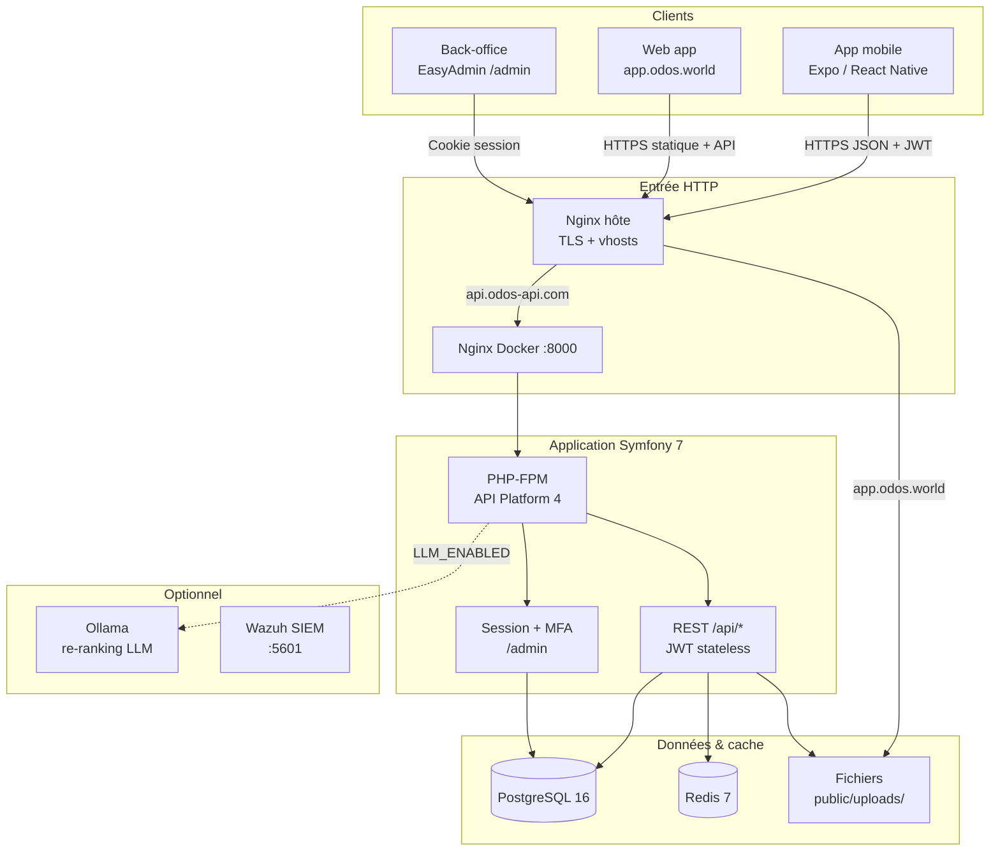

L'infrastructure s'exécute via **Docker Compose** : Nginx, PHP-FPM, PostgreSQL, Redis, Ollama (optionnel). En production, un **Nginx hôte** termine le TLS et proxifie l'API ; la web app est servie en statique depuis `/var/www/odos-web`.

### 6.2 Architecture backend : couches

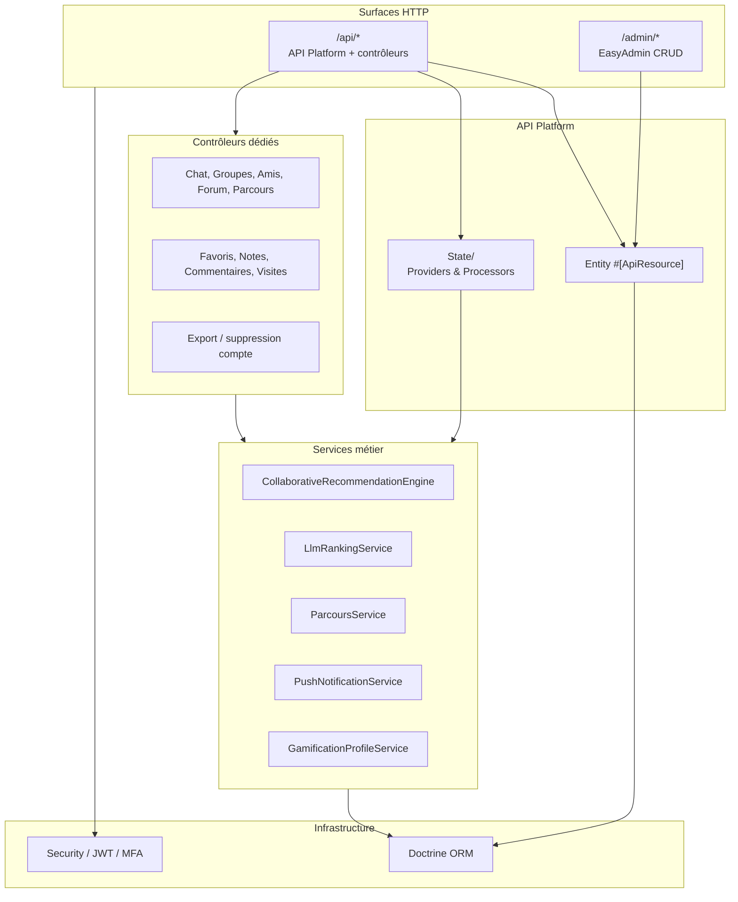

### 6.3 Architecture frontend : couches

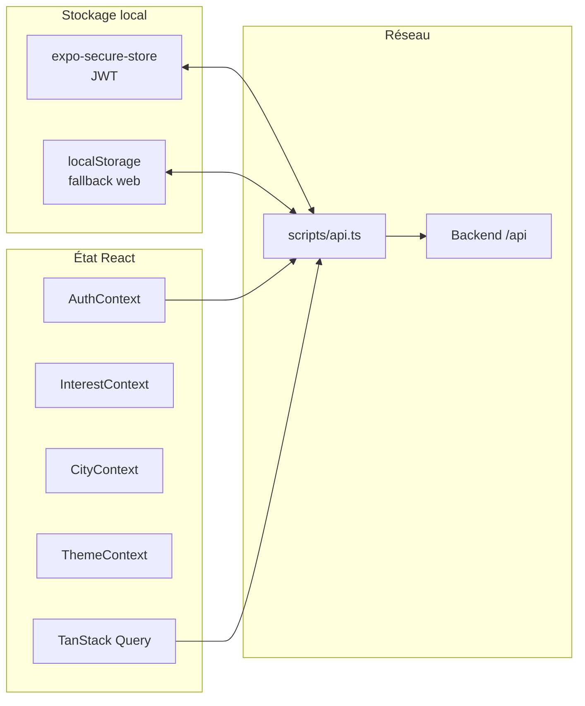

```
app/               ← Pages Expo Router (mobile + web)
  (tabs)/          ← Accueil, Recherche, Parcours, Communauté, Compte
  parcours/[id]    ← Détail parcours (carte, étapes, collaborateurs)
  chat/[id]        ← Messagerie privée
  community/       ← Forum, amis, messages, groupes

components/        ← UI réutilisable (carte, commentaires, modales ODOS)
hooks/             ← useActivities, useParcours, useChat, useRecommendations…
context/           ← Auth, Theme, City, Interest
scripts/api.ts     ← Axios + refresh JWT automatique
```

### 6.4 Architecture du moteur de recommandation (aperçu)

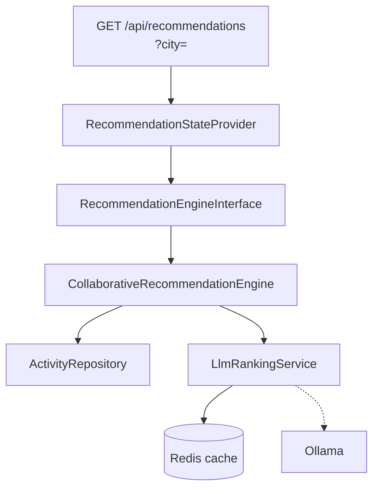

Pour tester un autre moteur (A/B test ou futur ML), il suffit de changer l'alias dans `config/services.yaml` :

```yaml
App\Recommendation\RecommendationEngineInterface: '@App\Recommendation\MlRecommendationEngine'
```

---

### 6.5 Algorithme de recommandation

C'est probablement la partie la plus importante du projet côté métier : transformer ce que l'utilisateur aime (catégories, favoris, visites) en une liste d'activités **nouvelles** pour lui, dans **sa ville**, dans un ordre qui a du sens.

#### 6.5.1 Pipeline en 4 étapes

En résumé, ça se passe en quatre temps :

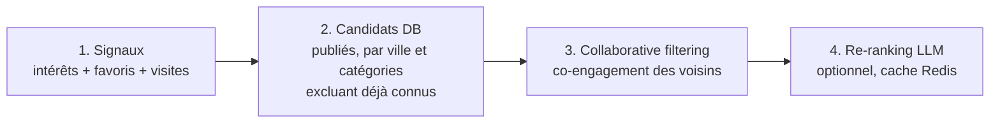

| Étape | Rôle | Détail technique |
|-------|------|------------------|
| **Signaux** | Graine du goût | `user.getInterests()`, `user_favorite_activity`, `user_visited_activity` |
| **Candidats** | Pool initial | `ActivityRepository::findRecommendationCandidates($categoryIds, $excludeIds, $city)` |
| **CF** | Boost social | `findCoEngagedActivityIds()` : voisins = users ayant liké/visité les mêmes lieux |
| **LLM** | Affinage | `LlmRankingService::rank()` : prompt Ollama, TTL Redis, repli sur ordre CF |

#### 6.5.2 Filtrage collaboratif (poids réglables)

- **Visite** (poids 2 par défaut) : quelqu'un qui est allé sur place compte plus qu'un simple favori.
- **Favori** (poids 1) : signale l'intention sans preuve de visite.
- On ne repropose **jamais** un lieu déjà en favori ou déjà marqué « visité ».
- Tout est filtré par **ville** (`?city=` ou ville enregistrée au profil). Sans ville, pas de reco (l'onboarding ville est obligatoire).

#### 6.5.3 Séquence complète

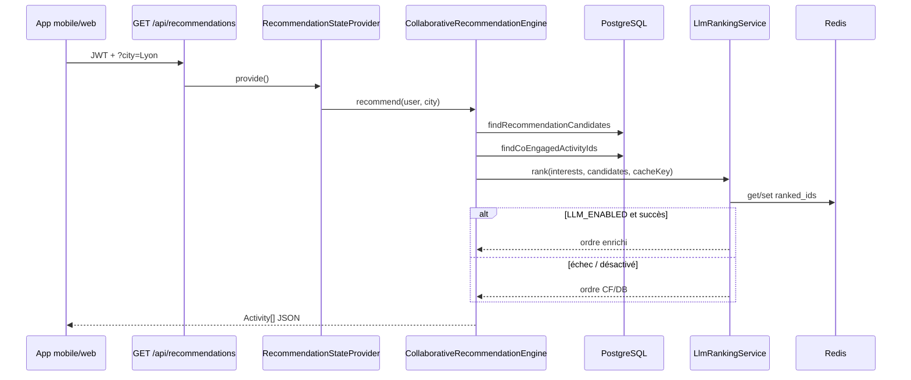

#### 6.5.4 Pourquoi ces choix ?

| Ce qu'on voulait | Ce qu'on a fait | Pourquoi |
|------------------|-----------------|----------|
| Comprendre les résultats | Filtrage collaboratif + règles claires | Testable en PHPUnit, défendable devant le jury |
| Respecter la vie privée | Ollama sur notre serveur | Pas d'email ni d'identité envoyés à un LLM cloud |
| Rester réactif | Cache Redis sur le ranking LLM | Pas d'appel lourd à chaque pull-to-refresh |
| Pouvoir changer d'algo plus tard | Interface `RecommendationEngineInterface` | Un alias Symfony suffit pour brancher un autre moteur |

---

### 6.6 Système de parcours collaboratifs

Les **parcours**, c'est la deuxième grosse brique fonctionnelle : une sorte de playlist d'activités. On enchaîne des lieux (karting, resto, musée…), on peut inviter des amis à co-éditer, mettre une pochette, et partager le tout en message ou sur la carte.

#### 6.6.1 Modèle fonctionnel

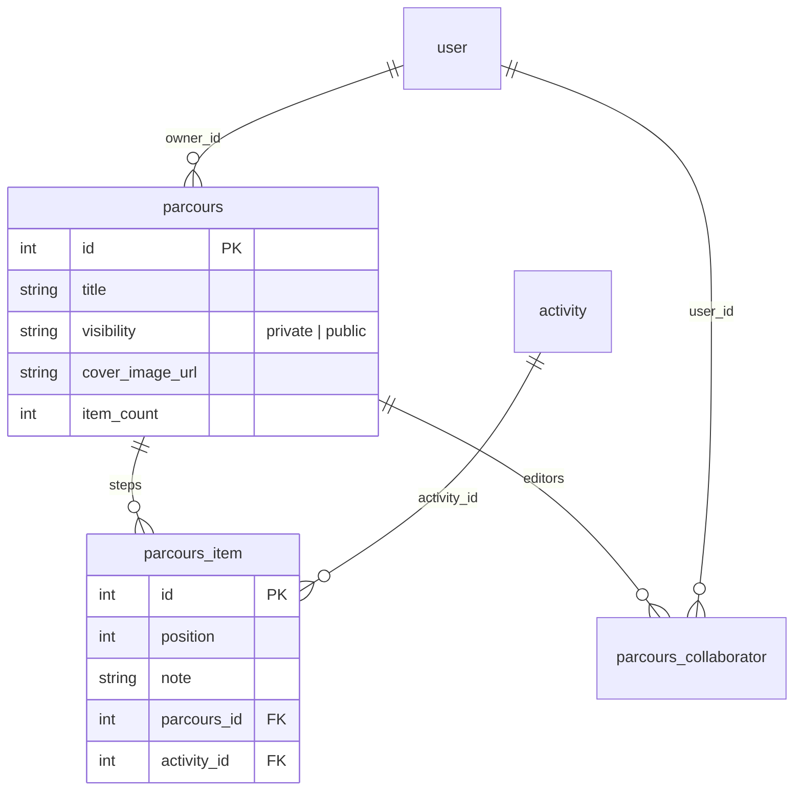

#### 6.6.2 Règles d'accès (`ParcoursService`)

| Action | Propriétaire | Collaborateur | Autre user (public) | Autre user (privé) |
|--------|-------------|---------------|---------------------|-------------------|
| Consulter | ✓ | ✓ | ✓ si `visibility=public` | ✗ |
| Éditer (titre, étapes, cover) | ✓ | ✓ | ✗ | ✗ |
| Ajouter collaborateur | ✓ | ✓ (amis uniquement) | ✗ | ✗ |
| Supprimer le parcours | ✓ | ✗ | ✗ | ✗ |

#### 6.6.3 API REST

| Méthode | Route | Rôle |
|---------|-------|------|
| GET | `/api/parcours` | Liste (mes parcours + collaboratifs) |
| POST | `/api/parcours` | Création |
| GET/PATCH/DELETE | `/api/parcours/{id}` | Détail, mise à jour, suppression |
| POST | `/api/parcours/{id}/items` | Ajouter une étape (activité + note) |
| PATCH | `/api/parcours/{id}/items/reorder` | Réordonner |
| DELETE | `/api/parcours/{id}/items/{itemId}` | Retirer une étape |
| POST/DELETE | `/api/parcours/{id}/cover` | Pochette (upload image) |
| POST/DELETE | `/api/parcours/{id}/collaborators/{userId}` | Gestion collaborateurs |

#### 6.6.4 Intégration front

- Onglet **Parcours** (`app/(tabs)/parcours.tsx`) : bibliothèque  
- Écran **détail** (`app/parcours/[id].tsx`) : carte MapLibre, tracé, pins numérotés, partage  
- Ajout depuis une **fiche activité** : bouton « Ajouter au parcours »  
- Partage en **chat** ou **groupe** : pièce jointe `parcoursId` sur `ChatMessage` / `GroupMessage`

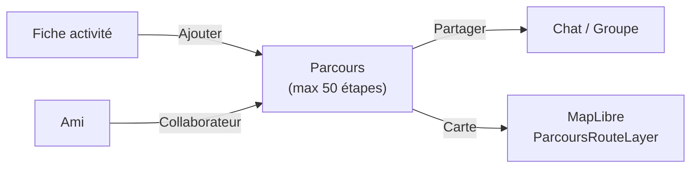

---

### 6.7 Modularité et extensibilité

J'ai structuré le projet pour pouvoir faire évoluer chaque brique sans tout casser : changer l'algo de reco, ajouter un thème, déployer seulement la web app, etc.

#### 6.7.1 Modularité backend

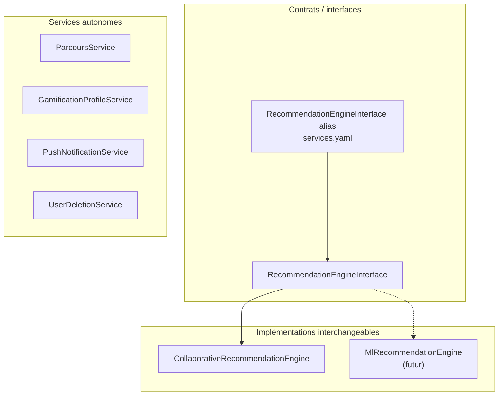

| Mécanisme | Exemple | Bénéfice |
|-----------|---------|----------|
| **Interface + alias DI** | `RecommendationEngineInterface` | Changer l'algo = 1 ligne YAML |
| **State Provider API Platform** | `RecommendationStateProvider` | Zéro logique métier dans l'adaptateur HTTP |
| **Enum + config env** | `RECO_VISIT_WEIGHT`, `LLM_ENABLED` | Réglage prod sans redéploiement code |
| **Services découplés** | `SocialUnreadCountService` sans dépendance circulaire push | Testabilité, maintenance |
| **Uploaders dédiés** | `ParcoursCoverUploader`, `ActivityPhotoUploader` | Règles fichiers centralisées |
| **Migrations Doctrine** | `odos-back/migrations/` | Schéma versionné, reproductible |

#### 6.7.2 Modularité frontend (mobile + web)

| Mécanisme | Fichier / pattern | Bénéfice |
|-----------|-------------------|----------|
| **Resolver Metro** | `metro.config.js` | `@maplibre/maplibre-react-native` → `MapLibreWeb` sur web uniquement |
| **Extensions `.web.ts`** | `use-color-scheme.web.ts` | Code web isolé |
| **`Platform.OS`** | push, badges OS | Capacités natives neutralisées sur web |
| **Hooks par domaine** | `useParcours.ts`, `useChat.ts` | Cache TanStack Query indépendant |
| **Contextes fins** | `ThemeContext`, `CityContext` | État global minimal |
| **Composants UI ODOS** | `OdosModalContext`, `BlobFrame` | Design system cohérent |
| **Thèmes distants** | `useThemes` + palettes registry | Nouveau thème = données admin, pas de release app |

#### 6.7.3 Modularité déploiement

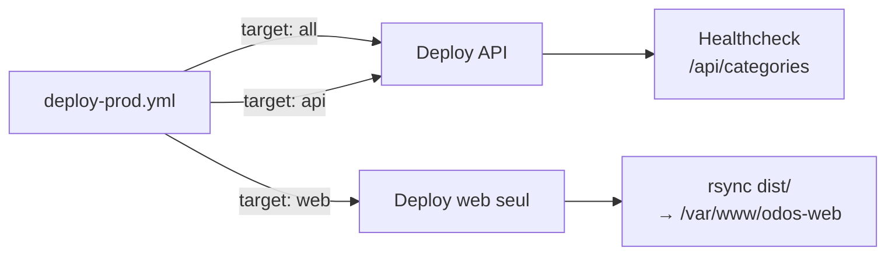

- **CI** : backend et frontend testés indépendamment  
- **Deploy** : jobs `deploy` et `deploy-web` séparables (`workflow_dispatch`)  
- **Docker profiles** : `llm`, `wazuh` optionnels sans impacter le cœur API  

---

## 7. Maquettes et enchaînement

### 7.1 Écran d'accueil (Recommandations)

```
┌─────────────────────────────────┐
│  ☀ Bonjour, Manuel             │
│  Vos recommandations du jour    │
├─────────────────────────────────┤
│ ┌─────────────────────────────┐ │
│ │ [Image]  Karting Lyon       │ │
│ │          ⭐ 4.3 / 12 avis   │ │
│ │          🏷 Sport · Lyon    │ │
│ │                    ❤ [  ]  │ │
│ └─────────────────────────────┘ │
│ ┌─────────────────────────────┐ │
│ │ [Image]  Musée des Beaux-A. │ │
│ │          ⭐ 4.7 / 89 avis   │ │
│ │          🏷 Culturel · Lyon │ │
│ │                    ❤ [✓]  │ │
│ └─────────────────────────────┘ │
├─────────────────────────────────┤
│ 🗺 Accueil  🔍 Carte  👤 Compte │
└─────────────────────────────────┘
```

### 7.2 Fiche activité

```
┌─────────────────────────────────┐
│ ← [Image plein écran]          │
├─────────────────────────────────┤
│ Karting Lyon Indoor             │
│ 📍 Lyon, 69007                  │
│                                 │
│ [ ✅ J'ai visité ce lieu  ]     │  ← Bouton toggle pill
│                                 │
│ ⭐⭐⭐⭐☆  4.3 (12 avis)        │
│ [  ★ Donner mon avis  ]        │
│                                 │
│ [  ❤ Ajouter aux favoris ]     │
│                                 │
│ Description…                    │
│                                 │
│ 💬 Commentaires (8)             │
│ ┌──────────────────────────┐   │
│ │ user42 · "Super soirée!" │   │
│ └──────────────────────────┘   │
└─────────────────────────────────┘
```

### 7.3 Carte interactive

```
┌─────────────────────────────────┐
│ 🔍 Rechercher une activité...   │
│                                 │
│   ┌────────────────────────┐    │
│   │  [Carte MapLibre]      │    │
│   │    📍  📍              │    │
│   │       📍📍📍           │    │
│   │    📍        3️⃣       │    │
│   └────────────────────────┘    │
│                                 │
│ ╔═══════════════════════════╗   │
│ ║ Karting Lyon Indoor       ║   │
│ ║ ⭐ 4.3 · Sport · 0€      ║   │
│ ║           [Voir la fiche]║   │
│ ╚═══════════════════════════╝   │
├─────────────────────────────────┤
│ 🗺 Accueil  🔍 Carte  👤 Compte │
└─────────────────────────────────┘
```

### 7.4 Paramètres / RGPD

```
┌─────────────────────────────────┐
│ ← Paramètres                   │
├─────────────────────────────────┤
│ [Avatar]  Manuel                │
│           manuel@email.fr       │
│ [Changer la photo] [Retirer]   │
│                                 │
│ PROFIL PUBLIC                   │
│ ┌─────────────────────────────┐ │
│ │ Alias: [manuel_l       ]    │ │
│ │ Bio:   [Ma bio…        ]    │ │
│ │      [Enregistrer]          │ │
│ └─────────────────────────────┘ │
│                                 │
│ MES DONNÉES                     │
│ ┌─────────────────────────────┐ │
│ │ 📥 Exporter mes données PDF │ │
│ └─────────────────────────────┘ │
│                                 │
│ ZONE DANGEREUSE                 │
│ [ 🗑 Supprimer mon compte ]     │
└─────────────────────────────────┘
```

### 7.5 Enchaînement des écrans (flux principal)

```
Splash ──► Onboarding ──► Inscription/Connexion
                                │
                                ▼
            ┌───────────────────────────────┐
            │ Sélection des intérêts        │
            └───────────────────────────────┘
                                │
                    ┌───────────┴────────────┐
                    │                        │
                    ▼                        ▼
            Onglet Accueil           Onglet Carte
            (Recommandations)        (MapLibre)
                    │                        │
            Onglet Parcours          Onglet Communauté
            (Bibliothèque)           (Forum, Amis, Chat)
                    │                        │
                    └───────────┬────────────┘
                                │
                                ▼
                    Fiche Activité [id]
                    ├── Note / Commentaire
                    ├── Toggle Favori
                    ├── Toggle Visité
                    └── Ajouter au parcours
                                │
                                ▼
                    Parcours [id] (carte, étapes, partage)

            Onglet Compte ──► Paramètres ──► Export PDF
                                         └── Suppression compte
```

---

## 8. Modèle de données

> **Schéma complet (34 tables, toutes colonnes)** : [ARCHITECTURE_MERMAID.md §10–18](ARCHITECTURE_MERMAID.md#10-base-de-données--vue-globale)

### 8.1 Vue globale des entités

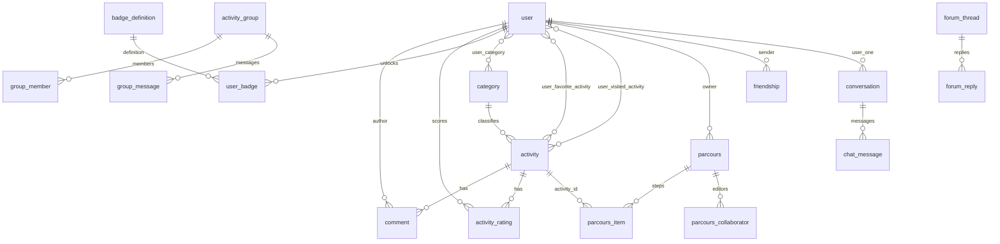

### 8.2 Domaines fonctionnels

```mermaid
flowchart TB
  subgraph catalog["Catalogue"]
    user
    category
    activity
    comments
    activity_rating
  end

  subgraph reco["Recommandations"]
    user_favorite_activity
    user_visited_activity
    user_activity_view
  end

  subgraph social["Social"]
    friendship
    conversation
    chat_message
    activity_group
    group_message
    shared_activity
    forum_thread
    forum_reply
  end

  subgraph parcours["Parcours"]
    parcours
    parcours_item
    parcours_collaborator
  end

  subgraph gamif["Gamification"]
    badge_definition
    user_badge
    user_badge_display
    user_map_cell
  end

  subgraph system["Système"]
    refresh_tokens
    push_token
    app_theme
    admin_audit_log
  end
```

### 8.3 Modèle physique : inventaire (34 tables)

| Domaine | Tables |
|---------|--------|
| **Utilisateurs & catalogue** | `user`, `category`, `activity`, `comments`, `activity_rating`, `user_category`, `user_favorite_activity`, `user_visited_activity`, `user_activity_view` |
| **Recommandations / exploration** | `user_map_cell` |
| **Parcours** | `parcours`, `parcours_item`, `parcours_collaborator` |
| **Social** | `friendship`, `conversation`, `chat_message`, `activity_group`, `group_member`, `group_invitation`, `group_message`, `shared_activity`, `content_report` |
| **Forum** | `forum_thread`, `forum_reply`, `forum_reply_like`, `forum_report` |
| **Gamification** | `badge_definition`, `user_badge`, `user_badge_display` |
| **Thèmes & technique** | `app_theme`, `push_token`, `refresh_tokens`, `admin_audit_log`, `admin_webauthn_credential` |

### 8.4 Tables cœur (extrait colonnes)

| Table | Colonnes clés | Contraintes |
|-------|-------------|-------------|
| `user` | `email`, `alias`, `home_city`, `password`, `roles`, `consented_at`, `social_consented_at`, `profile_public` | `UNIQUE(email)`, `UNIQUE(alias)` |
| `activity` | `name`, `latitude`, `longitude`, `city`, `category_id`, `is_published`, `rating_average`, `rating_count` | `FK → category` |
| `parcours` | `title`, `visibility`, `cover_image_url`, `item_count`, `owner_id` | `FK → user` |
| `parcours_item` | `position`, `note`, `parcours_id`, `activity_id` | index `(parcours_id, position)` |
| `badge_definition` | `code`, `name`, `rule_type`, `rule_config`, `is_active` | `UNIQUE(code)` |
| `app_theme` | `slug`, `label`, `light_palette`, `dark_palette`, `is_active` | `UNIQUE(slug)` |
| `user_favorite_activity` | `user_id`, `activity_id` | PK composite, CASCADE |
| `user_visited_activity` | `user_id`, `activity_id` | PK composite, CASCADE |
| `activity_rating` | `score`, `user_id`, `activity_id` | `UNIQUE(user_id, activity_id)` |
| `refresh_tokens` | `refresh_token`, `username`, `valid` | `UNIQUE(refresh_token)` |

### 8.5 Index de performance

```sql
-- Recommandations : filtrage par catégorie et publication
CREATE INDEX idx_activity_category_published
    ON activity (category_id, is_published);

-- Collaborative filtering : jointures sur les tables signaux
CREATE INDEX IDX_USER_VISITED_USER     ON user_visited_activity (user_id);
CREATE INDEX IDX_USER_VISITED_ACTIVITY ON user_visited_activity (activity_id);
CREATE INDEX IDX_USER_FAV_USER         ON user_favorite_activity (user_id);
CREATE INDEX IDX_USER_FAV_ACTIVITY     ON user_favorite_activity (activity_id);

-- Commentaires par activité (pagination)
CREATE INDEX idx_comment_activity_created ON comments (activity_id, created_at);

-- Parcours : ordre des étapes
CREATE INDEX idx_parcours_item_position ON parcours_item (parcours_id, position);
```

---

## 9. Scripts SQL

### 9.1 Création de la table user_visited_activity (migration Doctrine)

```sql
-- Migration Version20260607130000

CREATE TABLE user_visited_activity (
    user_id     INTEGER NOT NULL,
    activity_id INTEGER NOT NULL,
    PRIMARY KEY (user_id, activity_id)
);

CREATE INDEX IDX_USER_VISITED_USER
    ON user_visited_activity (user_id);

CREATE INDEX IDX_USER_VISITED_ACTIVITY
    ON user_visited_activity (activity_id);

ALTER TABLE user_visited_activity
    ADD CONSTRAINT FK_USER_VISITED_USER
    FOREIGN KEY (user_id)
    REFERENCES "user" (id)
    ON DELETE CASCADE
    NOT DEFERRABLE INITIALLY IMMEDIATE;

ALTER TABLE user_visited_activity
    ADD CONSTRAINT FK_USER_VISITED_ACTIVITY
    FOREIGN KEY (activity_id)
    REFERENCES activity (id)
    ON DELETE CASCADE
    NOT DEFERRABLE INITIALLY IMMEDIATE;
```

**Justification :** La cascade `ON DELETE CASCADE` sur les deux clés étrangères garantit qu'à la suppression d'un utilisateur (RGPD art. 17) ou d'une activité retirée du catalogue, les enregistrements orphelins sont automatiquement purgés sans appel explicite dans le service métier.

### 9.2 Requête collaborative filtering (extrait `ActivityRepository`)

```sql
-- Étape 1 : trouver les voisins (users ayant partagé un signal avec l'utilisateur)
SELECT DISTINCT neighbor.user_id
FROM user_visited_activity neighbor
WHERE neighbor.activity_id IN (:seedIds)
  AND neighbor.user_id <> :userId

UNION

SELECT DISTINCT neighbor.user_id
FROM user_favorite_activity neighbor
WHERE neighbor.activity_id IN (:seedIds)
  AND neighbor.user_id <> :userId;

-- Étape 2 : scorer les activités candidates par engagement des voisins
SELECT
    a.id,
    SUM(CASE WHEN v.user_id IS NOT NULL THEN :visitWeight ELSE 0 END)
    + SUM(CASE WHEN f.user_id IS NOT NULL THEN :favoriteWeight ELSE 0 END) AS score
FROM activity a
LEFT JOIN user_visited_activity  v ON v.activity_id = a.id AND v.user_id IN (:neighborIds)
LEFT JOIN user_favorite_activity f ON f.activity_id = a.id AND f.user_id IN (:neighborIds)
WHERE a.id NOT IN (:excludeIds)
  AND (v.user_id IS NOT NULL OR f.user_id IS NOT NULL)
GROUP BY a.id
ORDER BY score DESC
LIMIT :limit;
```

### 9.3 Export RGPD : consultation des données utilisateur

```sql
-- Vérification de cohérence : données d'un utilisateur avant export
SELECT
    u.email,
    u.alias,
    u.consented_at,
    COUNT(DISTINCT ufa.activity_id) AS nb_favoris,
    COUNT(DISTINCT uva.activity_id) AS nb_visites,
    COUNT(DISTINCT c.id)            AS nb_commentaires,
    COUNT(DISTINCT ar.id)           AS nb_notes
FROM "user" u
LEFT JOIN user_favorite_activity ufa ON ufa.user_id = u.id
LEFT JOIN user_visited_activity  uva ON uva.user_id = u.id
LEFT JOIN comment c ON c.user_id = u.id
LEFT JOIN activity_rating ar ON ar.user_id = u.id
WHERE u.id = :userId
GROUP BY u.id, u.email, u.alias, u.consented_at;
```

---

## 10. Diagrammes de cas d'utilisation

### 10.1 UC global

```
                    ┌─────────────────────────────────────────┐
                    │             Système ODOS                │
                    │                                         │
Visiteur ──────────►│ Consulter le catalogue                  │
                    │ Rechercher par position / catégorie     │
                    │ Consulter la carte                      │
                    │                                         │
Utilisateur ───────►│ (extends Visiteur)                      │
connecté            │ S'inscrire / Se connecter               │
                    │ Gérer ses favoris                       │
                    │ Signaler « J'ai visité »                │
                    │ Recevoir des recommandations            │
                    │ Noter / Commenter une activité          │
                    │ Exporter ses données (PDF)              │
                    │ Supprimer son compte                    │
                    │ Modifier son profil (alias, bio, avatar)│
                    │                                         │
Opérateur ─────────►│ Gérer le catalogue (CRUD activités)     │
(admin)             │ Gérer les catégories et badges          │
                    │ Modérer les commentaires                │
                    │ Consulter les statistiques              │
                    │ (s'authentifie avec MFA)                │
                    └─────────────────────────────────────────┘
```

### 10.2 UC Recommandations (détail)

```
┌──────────────────────────────────────────────────────┐
│              UC : Recommandations                    │
│                                                      │
│  Utilisateur ──►  [Accéder à l'onglet Accueil]       │
│                          │                           │
│                          ▼                           │
│              [Charger les recommandations]           │
│               GET /api/recommendations               │
│                          │                           │
│              ┌───────────┴──────────┐                │
│              │                      │                │
│              ▼                      ▼                │
│   [Filtrage par intérêts]  [CF si signaux présents]  │
│              │                      │                │
│              └───────────┬──────────┘                │
│                          │                           │
│              [Re-ranking LLM si activé]              │
│                          │                           │
│              [Affichage liste ordonnée]              │
│                          │                           │
│     ┌────────────────────┼────────────────────┐      │
│     │                    │                    │      │
│  [Toggle favori]  [Voir fiche]  [« J'ai visité »]   │
│     │                                    │           │
│  [Invalide cache recommandations]         │           │
│                         [Invalide cache recomm.]     │
└──────────────────────────────────────────────────────┘
```

### 10.3 UC Sécurité et RGPD

```
┌──────────────────────────────────────────────────────┐
│              UC : Données personnelles               │
│                                                      │
│  Utilisateur ──► [Accéder aux Paramètres]            │
│                          │                           │
│          ┌───────────────┼───────────────┐           │
│          │               │               │           │
│          ▼               ▼               ▼           │
│  [Modifier profil]  [Export PDF]  [Supprimer compte] │
│          │               │               │           │
│  PATCH /api/users/{id}   │      DELETE /api/me       │
│                          │       {confirm: true}     │
│               GET /api/me/export                     │
│               → génération PDF côté app              │
│               → expo-print + expo-sharing            │
└──────────────────────────────────────────────────────┘
```

---

## 11. Diagrammes de séquence

### 11.1 Authentification JWT avec refresh automatique

```
Client App          Axios Interceptor       API Symfony
    │                      │                     │
    │ Request + Bearer      │                     │
    │──────────────────────►│                     │
    │                       │ Forward request     │
    │                       │────────────────────►│
    │                       │                     │
    │                       │  401 Unauthorized   │
    │                       │◄────────────────────│
    │                       │                     │
    │                       │ POST /api/token/refresh
    │                       │ { refresh_token }   │
    │                       │────────────────────►│
    │                       │                     │
    │                       │ 200 { token, refresh_token }
    │                       │◄────────────────────│
    │                       │                     │
    │                       │ Retry original req  │
    │                       │ Bearer NEW_TOKEN     │
    │                       │────────────────────►│
    │                       │                     │
    │                       │ 200 OK + data        │
    │                       │◄────────────────────│
    │ Response data         │                     │
    │◄──────────────────────│                     │
```

**Justification technique :** l'intercepteur Axios dans `scripts/api.ts` écoute les réponses 401. Si le refresh token est valide, il renouvelle silencieusement le JWT et rejoue la requête originale. L'utilisateur ne perçoit aucune interruption. En cas d'échec du refresh, il est redirigé vers l'écran de connexion et les tokens sont effacés du SecureStore.

### 11.2 Pipeline de recommandation

```
Client App      StateProvider      Engine          Repository      LlmService
    │                │                │                 │               │
    │ GET /api/reco  │                │                 │               │
    │───────────────►│                │                 │               │
    │                │ recommend(user)│                 │               │
    │                │───────────────►│                 │               │
    │                │                │ findCandidates  │               │
    │                │                │ (categoryIds,   │               │
    │                │                │  excludeIds)    │               │
    │                │                │────────────────►│               │
    │                │                │ [Activity]      │               │
    │                │                │◄────────────────│               │
    │                │                │                 │               │
    │                │                │ findCoEngaged   │               │
    │                │                │ (si knownIds≠∅) │               │
    │                │                │────────────────►│               │
    │                │                │ [activityIds]   │               │
    │                │                │◄────────────────│               │
    │                │                │                 │               │
    │                │                │ boostCoEngaged  │               │
    │                │                │ (réordonne)     │               │
    │                │                │                 │               │
    │                │                │ rank(interests, candidates, key)│
    │                │                │───────────────────────────────►│
    │                │                │                 │  check Redis  │
    │                │                │                 │ (cache hit ?) │
    │                │                │                 │               │
    │                │                │                 │  POST Ollama  │
    │                │                │                 │  (si miss)    │
    │                │                │                 │               │
    │                │                │ [Activity] ordered             │
    │                │                │◄───────────────────────────────│
    │                │ [Activity]     │                 │               │
    │                │◄───────────────│                 │               │
    │ 200 JSON array │                │                 │               │
    │◄───────────────│                │                 │               │
```

### 11.3 Toggle « J'ai visité » avec optimistic update

```
Client App      TanStack Query      API             BDD
    │                │               │               │
    │ onPress        │               │               │
    │ [isVisited=true optimiste]     │               │
    │ updateQueryCache(['visitedIds'])│               │
    │───────────────►│               │               │
    │                │               │               │
    │                │ POST /api/activities/{id}/visited
    │                │──────────────►│               │
    │                │               │ INSERT uva    │
    │                │               │──────────────►│
    │                │               │ OK            │
    │                │               │◄──────────────│
    │                │ {isVisited:true}              │
    │                │◄──────────────│               │
    │                │               │               │
    │                │ invalidate(['visitedIds'])     │
    │                │ invalidate(['recommendations'])│
    │◄───────────────│               │               │
    │ [si erreur : rollback optimiste]               │
```

### 11.4 Export données RGPD en PDF

```
Client App       exportMyData()     API              expo-print    expo-sharing
    │                  │              │                   │              │
    │ onPress Export   │              │                   │              │
    │─────────────────►│              │                   │              │
    │                  │ GET /api/me/export               │              │
    │                  │─────────────►│                   │              │
    │                  │ JSON (profil,│                   │              │
    │                  │ favoris,     │                   │              │
    │                  │ visites,     │                   │              │
    │                  │ badges...)   │                   │              │
    │                  │◄─────────────│                   │              │
    │                  │              │                   │              │
    │ shareExportAsPdf(data)          │                   │              │
    │─────────────────────────────────────────────────►  │              │
    │                  │ buildHtml()  │                   │              │
    │                  │ (HTML templ.)│                   │              │
    │                  │              │ printToFileAsync  │              │
    │                  │              │──────────────────►│              │
    │                  │              │ { uri: file.pdf } │              │
    │                  │              │◄──────────────────│              │
    │                  │              │                   │ shareAsync   │
    │                  │              │                   │─────────────►│
    │ [Dialog partage natif]          │                   │              │
    │◄────────────────────────────────────────────────────────────────── │
```

---

## 12. Spécifications techniques et sécurité

### 12.1 Authentification et gestion des sessions

**JWT (JSON Web Tokens) : Lexik JWT Bundle**

- Access token : durée de vie **15 minutes** (`JWT_TOKEN_TTL=900`)
- Algorithme : RS256 (clé privée / publique RSA)
- Refresh token : durée de vie **30 jours** (`JWT_REFRESH_TTL=2592000`), stocké en BDD
- Stockage mobile : `expo-secure-store` (chiffrement Keychain iOS / Keystore Android)
- Intercepteur Axios : renouvellement transparent du JWT à l'expiration (401 → refresh → retry)
- Logout : invalidation du refresh token en BDD + purge du SecureStore

**MFA Back-office : 3 facteurs disponibles**

| Facteur | Implémentation |
|--------|---------------|
| TOTP | `scheb/2fa-totp`, compatible Google Authenticator |
| SMS | Twilio (`TWILIO_ACCOUNT_SID`, `TWILIO_AUTH_TOKEN`) |
| WebAuthn | `web-auth/webauthn-framework`, biométrie navigateur |

### 12.2 Protection contre les abus (rate limiting)

| Endpoint | Limite | Fenêtre |
|---------|--------|--------|
| `POST /api/login_check` | 5 tentatives | 1 minute / IP |
| `POST /api/users` (inscription) | 3 tentatives | 1 heure / IP |
| `POST /api/social-auth/*` | 10 tentatives | 1 heure / IP |
| `POST /api/password-reset/request` | 3 tentatives | 15 min / email |
| Commentaires | 1 commentaire | 30 secondes / utilisateur |
| Notes | 1 note/modification | 10 secondes / utilisateur |
| Avatar upload | 1 upload | 10 secondes / utilisateur |

Implémentation : `Symfony\Component\RateLimiter` (token bucket) + `UserActionThrottleService` (mémoire Redis pour le throttle métier). Réponse 429 avec header `Retry-After`.

### 12.3 Validation et sanitization des données

**Backend (Symfony)**

- Validation Symfony (`Assert\*`) sur toutes les entités
- `alias` : regex `^[\p{L}\p{N}\s\-_'.]+$/u` : interdit les balises et caractères de contrôle
- `bio` : `strip_tags()` dans le setter + regex interdit `<` et `>` (double protection XSS)
- Commentaires : `CommentContentSanitizer` : suppression de toute balise HTML, normalisation des espaces
- Mots de passe : hashés Argon2id (`SODIUM_CRYPTO_PWHASH_ALG_ARGON2ID13`)

**Frontend (React Native)**

- `sanitizeInline()` dans `settings.tsx` : retire `<` et `>`
- `validateAlias()` : miroir de la contrainte backend
- Compteur de caractères live pour la bio (500 max)

### 12.4 Protection des données sensibles

- Mots de passe : jamais en clair dans les logs : `SensitiveDataProcessor` Monolog filtre les champs `password`, `token`, `refresh_token`
- Emails admin : pseudonymisés dans les logs d'audit (`EmailPseudonymizer` → SHA-256)
- Tokens JWT : non persistés côté serveur (stateless), sauf refresh tokens (BDD chiffrée)
- Variables d'environnement : `.env.local` exclu du Git, `.env.example` fourni sans valeurs sensibles

### 12.5 Sécurité CORS

```php
// CORS_ALLOW_ORIGIN en dev (Expo / réseau local)
'^https?://(localhost|127\.0\.0\.1|192\.168\.[0-9]+\.[0-9]+)(:[0-9]+)?$'
```

### 12.6 Sécurité du LLM

Le modèle Ollama (`qwen2.5:1.5b`) est auto-hébergé. Les données envoyées sont strictement limitées aux métadonnées d'activités (nom, catégorie, ville, note moyenne) et aux noms des intérêts de l'utilisateur : jamais d'email ni d'identité personnelle.

**Validations de sécurité sur la réponse LLM :**
- Seuls les IDs présents dans la liste candidate initiale sont conservés
- Les IDs inconnus / inventés par le modèle sont filtrés
- Timeout 3 secondes : repli automatique sur l'ordre CF/DB en cas d'échec

---

## 13. Extraits de code significatifs

### 13.1 Moteur de recommandation : CollaborativeRecommendationEngine

**Fichier :** `odos-back/src/Recommendation/CollaborativeRecommendationEngine.php`

```php
final class CollaborativeRecommendationEngine implements RecommendationEngineInterface
{
    public function __construct(
        private readonly ActivityRepository $activityRepository,
        private readonly LlmRankingService $llmRankingService,
        private readonly float $visitWeight = 2.0,
        private readonly float $favoriteWeight = 1.0,
        private readonly int $candidateLimit = 50,
    ) {}

    public function recommend(User $user): array
    {
        // Lieux déjà connus : graine du goût ET filtre d'exclusion.
        $visitedIds  = $this->collectIds($user->getVisitedActivities());
        $favoriteIds = $this->collectIds($user->getFavorites());
        $knownIds    = array_values(array_unique([...$visitedIds, ...$favoriteIds]));

        $interests    = $user->getInterests();
        $categoryIds  = array_values(array_filter(
            $interests->map(static fn ($c) => $c->getId())->toArray(),
            static fn ($id) => null !== $id,
        ));
        $interestNames = array_values(
            $interests->map(static fn ($c) => $c->getName())->toArray()
        );

        $candidates = $this->activityRepository->findRecommendationCandidates($categoryIds, $knownIds);
        $candidates = $this->boostCoEngaged($candidates, $user->getId(), $knownIds);

        return $this->llmRankingService->rank(
            $interestNames,
            $candidates,
            $this->cacheKey($user->getId(), $categoryIds, $knownIds),
        );
    }

    private function boostCoEngaged(array $candidates, ?int $userId, array $seedIds): array
    {
        if (null === $userId || [] === $seedIds || [] === $candidates) {
            return $candidates; // pas de graine = pas de CF
        }

        $coEngagedIds = $this->activityRepository->findCoEngagedActivityIds(
            $userId, $seedIds, $seedIds,
            $this->visitWeight, $this->favoriteWeight, $this->candidateLimit,
        );

        if ([] === $coEngagedIds) {
            return $candidates; // aucun voisin trouvé
        }

        // Reconstruction de l'ordre : co-engagés en tête, reste en ordre DB.
        $byId = [];
        foreach ($candidates as $activity) {
            if (null !== ($id = $activity->getId())) {
                $byId[$id] = $activity;
            }
        }

        $boosted = [];
        foreach ($coEngagedIds as $id) {
            if (isset($byId[$id])) {
                $boosted[] = $byId[$id];
                unset($byId[$id]);
            }
        }
        foreach ($candidates as $activity) {
            if (null !== ($id = $activity->getId()) && isset($byId[$id])) {
                $boosted[] = $activity;
            }
        }

        return $boosted;
    }
}
```

**Argumentation :** La séparation entre politique (moteur) et données (repository) permet de tester le moteur sans base de données (repository mocké). Le poids `visitWeight = 2.0 > favoriteWeight = 1.0` reflète qu'une visite réelle est une preuve d'expérience plus forte qu'un simple favori (intention). Ces poids sont injectés depuis `config/services.yaml` et surchargeables par variable d'environnement sans redéploiement.

---

### 13.2 Interface d'isolation : RecommendationEngineInterface

**Fichier :** `odos-back/src/Recommendation/RecommendationEngineInterface.php`

```php
namespace App\Recommendation;

use App\Entity\Activity;
use App\Entity\User;

interface RecommendationEngineInterface
{
    /** @return array<Activity> */
    public function recommend(User $user, ?string $city = null): array;
}
```

**Argumentation :** Cette interface à contrat minimal permet de remplacer l'algorithme (A-B test, moteur ML, popularité) sans modifier `RecommendationStateProvider` ni la couche API. L'alias dans `services.yaml` est le seul point de couplage.

---

### 13.3 Toggle « J'ai visité » : VisitedActivityController

**Fichier :** `odos-back/src/Controller/VisitedActivityController.php`

```php
#[Route('/api/activities/{id}/visited', name: 'api_activity_visited_')]
class VisitedActivityController extends AbstractController
{
    #[Route('', name: 'add', methods: ['POST'])]
    public function addVisited(int $id): JsonResponse
    {
        $activity = $this->resolveActivity($id);
        if ($activity instanceof JsonResponse) {
            return $activity;
        }

        $user = $this->security->getUser();
        if (!$user instanceof User) {
            throw $this->createAccessDeniedException('Utilisateur invalide.');
        }

        if (!$user->hasVisited($activity)) {
            $user->addVisitedActivity($activity);
            $this->em->flush();
        }

        return $this->json(['isVisited' => true]);
    }

    #[Route('', name: 'remove', methods: ['DELETE'])]
    public function removeVisited(int $id): JsonResponse { /* ... symétrique */ }

    private function resolveActivity(int $id): Activity|JsonResponse
    {
        $this->denyAccessUnlessGranted('ROLE_USER');
        $activity = $this->activityRepository->find($id);
        if (!$activity) {
            return $this->json(['message' => 'Activité introuvable.'], 404);
        }
        if (!$activity->isPublished() && !$this->security->isGranted('ROLE_ADMIN')) {
            return $this->json(['message' => 'Activité non disponible.'], 404);
        }
        return $activity;
    }
}
```

**Argumentation :** La méthode `hasVisited()` sur l'entité `User` est idempotente : un double appel POST ne crée pas de doublon en BDD. La vérification `isPublished()` empêche d'interagir avec des activités retirées du catalogue (sécurité), sauf pour un admin qui peut tester ses brouillons.

---

### 13.4 Intercepteur JWT Axios avec refresh automatique

**Fichier :** `odos-front/scripts/api.ts`

```typescript
api.interceptors.response.use(
    (response) => response,
    async (error: AxiosError) => {
        const originalRequest = error.config as AxiosRequestConfig & {
            _retry?: boolean;
        };

        // Évite la boucle infinie si le refresh lui-même échoue
        if (
            error.response?.status === 401 &&
            !originalRequest._retry &&
            originalRequest.url !== '/api/token/refresh'
        ) {
            originalRequest._retry = true;

            const refreshToken = await SecureStore.getItemAsync('refresh_token');
            if (!refreshToken) {
                await clearAuthStorage();
                return Promise.reject(error);
            }

            try {
                const { data } = await api.post('/api/token/refresh', {
                    refresh_token: refreshToken,
                });
                await SecureStore.setItemAsync('jwt_token', data.token);
                await SecureStore.setItemAsync('refresh_token', data.refresh_token);

                // Rejoue la requête originale avec le nouveau token
                if (originalRequest.headers) {
                    originalRequest.headers['Authorization'] = `Bearer ${data.token}`;
                }
                return api(originalRequest);
            } catch {
                await clearAuthStorage();
                return Promise.reject(error);
            }
        }

        return Promise.reject(error);
    }
);
```

**Argumentation :** Le flag `_retry` empêche la boucle infinie (la requête de refresh elle-même retournant un 401 ne déclencherait pas un nouveau refresh). `clearAuthStorage()` efface proprement les tokens du SecureStore et redirige l'utilisateur vers l'écran de connexion.

---

### 13.5 Génération du PDF RGPD : generateExportPdf.ts (extrait)

**Fichier :** `odos-front/utils/generateExportPdf.ts`

```typescript
export async function shareExportAsPdf(data: ExportData): Promise<void> {
    const html = buildHtml(data);

    // Génération native du PDF (WebKit sur iOS, Chrome WebView sur Android)
    const { uri } = await Print.printToFileAsync({ html, base64: false });

    const canShare = await Sharing.isAvailableAsync();
    if (!canShare) {
        throw new Error("Le partage de fichiers n'est pas disponible sur cet appareil.");
    }

    await Sharing.shareAsync(uri, {
        mimeType: 'application/pdf',
        dialogTitle: `Export de mes données ODOS : ${data.profile?.displayName ?? ''}`,
        UTI: 'com.adobe.pdf',
    });
}

function buildHtml(data: ExportData): string {
    // Page de garde avec dégradé violet ODOS + sections structurées
    // Table des notes avec étoiles Unicode (★ ☆)
    // Liste des favoris et visites avec ville
    // Footer RGPD avec email de contact
}
```

**Argumentation :** La génération côté client (expo-print) évite d'envoyer les données personnelles vers un service tiers de génération PDF. Le HTML est construit en mémoire, jamais transmis au réseau. `expo-print` utilise le moteur de rendu natif de l'OS (WebKit / Chromium), garantissant un rendu fidèle du CSS.

---

### 13.6 Sécurisation du setter Bio : Entity User

```php
public function setBio(?string $bio): static
{
    if (null === $bio) {
        $this->bio = null;
        return $this;
    }

    // Étage 1 : suppression de toutes les balises HTML (XSS)
    $clean = strip_tags($bio);
    // Étage 2 : normalisation des retours à la ligne
    $clean = str_replace(["\r\n", "\r"], "\n", $clean);
    // Étage 3 : suppression des espaces en début/fin
    $clean = trim($clean);
    // Étage 4 : chaîne vide → null (base propre)
    $this->bio = '' === $clean ? null : $clean;

    return $this;
}
```

**Argumentation :** La sanitization se fait au niveau de l'entité (pas uniquement du contrôleur) car c'est le dernier filet de sécurité avant la persistance. Même si un appel contourne le contrôleur standard (ex. commande Symfony en dev), la donnée sera toujours assainie. La contrainte `Assert\Regex` en annotation ajoute une validation explicite pour les messages d'erreur lisibles par le client.

---

## 14. Annexes

### Annexe A : Captures d'écran et interfaces utilisateur

#### A.1 Onglet Accueil (recommandations)

L'écran affiche la liste des recommandations personnalisées. Chaque carte inclut l'image de l'activité, son nom, sa note moyenne, sa catégorie et un bouton favori. Le bouton cœur utilise un optimistic update : il se met à jour instantanément sans attendre la réponse serveur.

**Code correspondant : composant FavoriteCard** (`odos-front/components/FavoriteCard.tsx`) :

```typescript
export function FavoriteCard({ activity, isFavorite, onToggle }: FavoriteCardProps) {
  const colors = useOdosColors();
  return (
    <Pressable style={styles.card} onPress={() => router.push(`/activity/${activity.id}`)}>
      <Image source={{ uri: resolveImageUrl(activity.imageUrl) }} style={styles.image} />
      <View style={styles.info}>
        <Text style={styles.name}>{activity.name}</Text>
        <Text style={styles.city}>{activity.city}</Text>
        {activity.ratingAverage && (
          <Text style={styles.rating}>⭐ {activity.ratingAverage.toFixed(1)}</Text>
        )}
      </View>
      <Pressable
        onPress={(e) => { e.stopPropagation(); onToggle(); }}
        accessibilityRole="button"
        accessibilityLabel={isFavorite ? 'Retirer des favoris' : 'Ajouter aux favoris'}
      >
        <Heart
          size={22}
          color={isFavorite ? colors.accent : colors.muted}
          fill={isFavorite ? colors.accent : 'none'}
        />
      </Pressable>
    </Pressable>
  );
}
```

#### A.2 Fiche activité : bouton « J'ai visité »

Le bouton est un pill (pill shape, `borderRadius: 100`) en bas de la section informations. À l'état inactif, fond `accentSoft` et texte violet ; à l'état actif, fond `accent` (violet plein) et texte blanc.

```typescript
<Pressable
  style={({ pressed }) => [
    styles.visitedButton,
    isVisited && styles.visitedButtonActive,
    pressed && styles.visitedButtonPressed,
  ]}
  onPress={onVisitedPress}
  disabled={toggleVisitedMutation.isPending || !canToggleFavorite}
  accessibilityRole="button"
  accessibilityState={{ selected: isVisited }}
  accessibilityLabel={isVisited ? 'Retirer « J\'ai visité »' : 'Marquer comme visité'}
>
  <CircleCheck
    color={isVisited ? colors.onAccent : colors.accent}
    fill={isVisited ? colors.accent : 'none'}
    size={20}
  />
  <Text style={[styles.visitedButtonText, isVisited && styles.visitedButtonTextActive]}>
    {isVisited ? 'Lieu visité' : 'J\'ai visité ce lieu'}
  </Text>
</Pressable>
```

#### A.3 Navigation par onglets avec icônes MaterialIcons

Les onglets utilisent `@expo/vector-icons` MaterialIcons (vectoriels, teintables dynamiquement) à la place des SVG raster précédents qui ne pouvaient pas s'adapter au thème.

```typescript
const renderTabIcon = (name: TabIconName, seed: number, label: string) =>
  ({ focused }: { focused: boolean }) => (
    <View style={styles.tabIconSlot} accessibilityLabel={label}>
      {focused ? (
        <BlobFrame size={44} seed={seed} backgroundColor={colors.accentSoft}>
          <MaterialIcons name={name} size={24} color={colors.accent} />
        </BlobFrame>
      ) : (
        <MaterialIcons name={name} size={24} color={colors.muted} />
      )}
    </View>
  );
```

**Justification du choix :** Les icônes SVG précédents embarquaient des images raster base64. L'attribut `color` SVG ne colorie que les formes vectorielles, pas les images bitmap. Le remplacement par MaterialIcons permet un changement de couleur natif par la prop `color`, compatible avec le mode sombre.

---

### Annexe B : Extraits de code : Composants d'accès aux données

#### B.1 findCoEngagedActivityIds : Collaborative Filtering (extrait)

**Fichier :** `odos-back/src/Repository/ActivityRepository.php`

```php
public function findCoEngagedActivityIds(
    int $userId,
    array $seedActivityIds,
    array $excludeIds,
    float $visitWeight = 2.0,
    float $favoriteWeight = 1.0,
    int $limit = 50,
): array {
    if ([] === $seedActivityIds) {
        return [];
    }

    $neighborIds = $this->findNeighborUserIds($userId, $seedActivityIds);
    if ([] === $neighborIds) {
        return [];
    }

    $scores = [];
    $this->accumulateRelationScores($scores, 'user_visited_activity',
        $neighborIds, $excludeIds, $visitWeight);
    $this->accumulateRelationScores($scores, 'user_favorite_activity',
        $neighborIds, $excludeIds, $favoriteWeight);

    arsort($scores);

    return array_slice(array_keys($scores), 0, $limit);
}

private function findNeighborUserIds(int $userId, array $seedActivityIds): array
{
    $sql = '
        SELECT DISTINCT uva.user_id FROM user_visited_activity uva
        WHERE uva.activity_id IN (:seeds) AND uva.user_id <> :userId
        UNION
        SELECT DISTINCT ufa.user_id FROM user_favorite_activity ufa
        WHERE ufa.activity_id IN (:seeds) AND ufa.user_id <> :userId
    ';
    $conn   = $this->getEntityManager()->getConnection();
    $result = $conn->executeQuery($sql, ['seeds' => $seedActivityIds, 'userId' => $userId],
        ['seeds' => ArrayParameterType::INTEGER]);
    return array_column($result->fetchAllAssociative(), 'user_id');
}
```

#### B.2 findRecommendationCandidates

```php
public function findRecommendationCandidates(
    array $categoryIds,
    array $excludeIds,
): array {
    $qb = $this->createQueryBuilder('a')
        ->where('a.isPublished = true');

    if ([] !== $categoryIds) {
        $qb->andWhere('IDENTITY(a.category) IN (:categoryIds)')
            ->setParameter('categoryIds', $categoryIds);
    }

    if ([] !== $excludeIds) {
        $qb->andWhere('a.id NOT IN (:excludeIds)')
            ->setParameter('excludeIds', $excludeIds);
    }

    return $qb->orderBy('a.id', 'DESC')->getQuery()->getResult();
}
```

---

### Annexe C : Composants métier

#### C.1 CommentContentSanitizer

**Fichier :** `odos-back/src/Service/CommentContentSanitizer.php`

Ce service nettoie le contenu des commentaires avant persistance :
- `strip_tags()` : supprime toutes les balises HTML (XSS)
- Normalisation des retours à la ligne
- Trim des espaces superflus
- Rejet du contenu vide après nettoyage (exception métier)

#### C.2 UserActionThrottleService

```php
// Empêche les abus via Redis (exemple commentaire)
public function check(User $user, string $action, int $ttlSeconds): void
{
    $key = sprintf('throttle:%s:%s:%d', $action, $ttlSeconds, $user->getId());
    if ($this->cache->hasItem($key)) {
        throw new ThrottledActionException($ttlSeconds);
    }
    $item = $this->cache->getItem($key);
    $item->set(1)->expiresAfter($ttlSeconds);
    $this->cache->save($item);
}
```

#### C.3 UserDeletionService (RGPD art. 17)

Le service orchestre la suppression complète du compte :
1. Anonymisation des commentaires (auteur → null, contenu conservé si non masqué)
2. Suppression du fichier avatar (Filesystem)
3. Invalidation des refresh tokens Gesdinet
4. Suppression de l'entité `User` (cascade ORM : favoris, visites, notes, badges, exploration)

---

### Annexe D : Éléments de sécurité

#### D.1 Analyse des vulnérabilités OWASP Top 10 : synthèse

| Risque OWASP | Mesure mise en œuvre |
|-------------|---------------------|
| A01 - Broken Access Control | `denyAccessUnlessGranted('ROLE_USER')` sur tous les endpoints sensibles, vérification `object == user` sur les opérations de profil |
| A02 - Cryptographic Failures | Argon2id pour les mots de passe, HTTPS obligatoire (Nginx), JWT RS256 |
| A03 - Injection | Doctrine ORM avec paramètres liés (jamais de SQL dynamique), validation des entrées |
| A04 - Insecure Design | Rate limiting multi-niveaux, MFA back-office, consentement RGPD explicite |
| A05 - Security Misconfiguration | `.env.local` hors Git, CORS restreint, headers sécurité Nginx |
| A06 - Vulnerable Components | Dépendances pinées (`pnpm overrides`, `composer.lock`), audit Dependabot |
| A07 - Auth Failures | JWT 15 min + refresh 30 j + rotation, throttle login 5/min, MFA admin |
| A08 - Data Integrity | Validation Symfony, sanitization setters entités, PHPStan L8 |
| A09 - Logging Failures | `SensitiveDataProcessor` Monolog, audit admin pseudonymisé |
| A10 - SSRF | LLM self-hosted (Ollama sur réseau Docker interne, pas d'URL externe) |

#### D.2 Plan de veille sécurité

| Source | Fréquence | Sujets suivis |
|-------|---------|-------------|
| CNIL (cnil.fr) | Mensuel | RGPD, nouvelles obligations, sanctions |
| OWASP Top 10 | Annuel (mise à jour) | Vulnérabilités applicatives |
| Symfony Security Advisories | À chaque release | CVE PHP/Symfony |
| npm audit / Dependabot | Hebdomadaire (CI) | CVE dépendances JS |
| Expo SDK Changelog | À chaque release | Sécurité mobile |
| HaveIBeenPwned API | : | Référence pour politique mots de passe |

---

### Annexe E : Plan de tests

#### E.1 Tests backend (PHPUnit 11)

| Fichier de test | Type | Ce qui est testé |
|----------------|-----|----------------|
| `CollaborativeRecommendationEngineTest` | Unitaire (sans DB) | Boosting CF, exclusion known ids, pas de CF sans graine, liste vide |
| `RecommendationTest` | Unitaire | LlmRankingService : validation des IDs, repli sur ordre initial |
| `GamificationServiceTest` | Intégration | Attribution de badges (nécessite Postgres) |

**Commandes :**
```bash
docker compose exec php php vendor/bin/phpunit tests/CollaborativeRecommendationEngineTest.php
docker compose exec php php vendor/bin/phpstan analyse src/ --level=7
```

#### E.2 Tests frontend (Jest + Testing Library)

| Fichier de test | Ce qui est testé |
|----------------|----------------|
| `components/ui/DaIcon.test.tsx` | Rendu DaIcon avec différents noms d'icônes |
| `hooks/useActivities.test.ts` | Fetch activités, gestion erreur, cache TanStack |

**Couverture cible : 70 %** (configurée dans `jest.config.js`, collectée sur les fichiers `hooks/`, `components/`, `utils/`, `services/`).

```bash
cd odos-front
pnpm test:coverage  # Rapport HTML → coverage/lcov-report/
```

#### E.3 Jeu d'essai : fonctionnalité « J'ai visité »

**Scénario nominal :**
1. Connexion avec un utilisateur ayant 3 favoris (catégorie Sport)
2. Accès à la fiche d'une activité non encore visitée
3. Appui sur « J'ai visité ce lieu » → état actif (fond violet, texte blanc)
4. Vérification BDD : `SELECT * FROM user_visited_activity WHERE user_id = :id` → 1 ligne
5. Accès à l'onglet Recommandations → l'activité n'apparaît plus
6. Rappui sur le bouton → état inactif → l'activité réapparaît dans les recommandations

**Scénario erreur réseau :**
1. Appui sur « J'ai visité » : réseau coupé
2. Mise à jour optimiste : bouton passe à l'état actif immédiatement
3. Timeout Axios → erreur capturée → rollback du cache → bouton revient à l'état inactif
4. Toast d'erreur affiché à l'utilisateur

**Scénario sécurité :**
1. `curl -X POST https://api/activities/99/visited` sans header `Authorization`
2. Réponse attendue : `401 Unauthorized`
3. `curl -X POST https://api/activities/99/visited -H "Authorization: Bearer EXPIRED_TOKEN"`
4. Réponse attendue : `401 Unauthorized` (le token expiré n'est pas renouvelé côté serveur)

#### E.4 CI/CD : Pipeline GitHub Actions

```yaml
# .github/workflows/ci.yml (extrait)
jobs:
  backend:
    steps:
      - composer install
      - php vendor/bin/phpunit          # Tests unitaires
      - php vendor/bin/phpstan analyse  # Analyse statique L8

  frontend:
    steps:
      - pnpm install
      - pnpm lint                       # ESLint expo
      - pnpm test:ci                    # Jest (no watch)
```

---

### Annexe F : Veille technologique

#### F.1 Innovations suivies et intégrées au projet

| Technologie | Veille | Application dans ODOS |
|------------|-------|----------------------|
| **LLM local (Ollama)** | Suivi des releases qwen2, phi-3, mistral | Re-ranking des recommandations sans envoi de données vers le cloud |
| **Expo SDK 54 / React Native 0.81** | Changelog Expo, React Native Blog | Architecture New Architecture (Fabric + JSI), suppression du Bridge |
| **API Platform 4** | Symfony Blog, documentation officielle | State Providers/Processors, sécurité déclarative `#[ApiResource]` |
| **TanStack Query v5** | Release notes, RFC | `gcTime` (ex `cacheTime`), invalidation multiple simultanée |
| **MapLibre GL Native** | GitHub Releases maplibre-react-native | Remplacement de Mapbox (licence), mode sombre natif |
| **Expo Router v6** | Changelog Expo | Navigation file-based, typage statique des routes |
| **RGPD : Délibérations CNIL** | Site cnil.fr, veille mensuelle | Mise à jour politique de confidentialité (visites, filtrage collaboratif, LLM) |

#### F.2 Choix architecturaux motivés par la veille

**LLM auto-hébergé vs cloud :**  
Les modèles SaaS (GPT-4, Claude) envoient les données utilisateur vers des serveurs externes, ce qui pose des problèmes RGPD. Ollama avec `qwen2.5:1.5b` tourne entièrement sur le serveur Docker, sans transfert externe. Le modèle 1.5B paramètres s'exécute sur CPU en < 3 secondes (TTL configuré), suffisant pour un re-ranking de 20 activités.

**Collaborative filtering vs ML pur :**  
La CF item-based choisie est interprétable, déterministe et testable (on peut vérifier pourquoi une activité est remontée). Un modèle ML en boîte noire aurait rendu les tests plus complexes et les explications aux utilisateurs impossibles. L'architecture en interface permet de migrer vers du ML plus tard.

**expo-print pour le PDF RGPD :**  
Les alternatives (envoi JSON à un service tiers de génération PDF, bibliothèque JS de rendu PDF) présentent soit des problèmes de vie privée, soit des limitations de rendu. `expo-print` utilise le moteur natif (WebKit sur iOS, Chromium sur Android) et génère le PDF entièrement sur l'appareil.

---

### Annexe G : Portage Web (web app responsive)

*(Ajout juin 2026 : mise en ligne d'une version web de l'app sur `app.odos.world`.)*

#### G.1 Bi-modularité : un seul code, deux runtimes

L'app mobile (Expo / React Native) est portée en **web app** via **react-native-web**, **sans
fork** : ~98 % du code (logique, état TanStack Query, contextes, écrans) est partagé. La divergence
web ↔ natif est isolée par **4 coutures explicites** :

| Mécanisme | Usage | Bénéfice |
|-----------|-------|----------|
| Résolution au bundling (resolver Metro) | `@maplibre/maplibre-react-native` → `MapLibreWeb` (maplibre-gl) sur web, natif sinon | `maplibre-gl` **jamais** dans le bundle Android (aucun surpoids APK) |
| Split par extension `.web.ts` | `use-color-scheme.web.ts` | Code web isolé dans un fichier dédié |
| Branchement runtime `Platform.OS` | push notifications gardées `!== 'web'` | Capacités natives neutralisées proprement sur web |
| Import dynamique sous garde | `expo-notifications` chargé seulement sur natif | Dépendance native hors du chemin web |

**Choix `web.output: "single"` (SPA)** : abandon du prerender SSR (`static`) qui entrait en conflit
avec les librairies client-only (reanimated, carte) : erreurs « multiple renderers » et crashs
d'hydratation. Le rendu 100 % client supprime cette classe de bugs.

#### G.2 Déploiement web (extension du pipeline CI/CD)

Le workflow `deploy-prod.yml` est étendu d'un job **`deploy-web`** : build statique
(`expo export -p web`) sur le runner GitHub, puis publication par `rsync` vers le VPS. Côté serveur,
un **vhost nginx** dédié (`app.odos.world`) sert les fichiers statiques avec **fallback SPA**
(`try_files … /index.html`), **HTTPS** via certbot, et l'**origin CORS** ajouté à l'API. Le pipeline
backend a été durci au passage (port nginx Docker, régénération du cache prod, healthcheck `/api/health`
avec rollback). *Réf. : [WEB_APP_DEPLOYMENT.md](WEB_APP_DEPLOYMENT.md).*

#### G.3 Responsivité (écrans larges)

L'app étant **mobile-first**, le rendu web sur grand écran étirait les cartes plein viewport. Mise en
place d'une stratégie **« mobile-first qui s'épanouit »** :

- **Hook `useResponsive()`** : source unique des breakpoints (600 / 1024 / 1440 px) et du nombre de
  colonnes recommandé : **règle : jamais de `numColumns` figé**.
- **Favoris** : colonnes adaptatives (2 phone / 3 tablette / 4–5 desktop) + bascule **Grille / Liste**
  (lignes compactes) pour scanner toute la collection.
- **Recherche** : largeurs de cartes **bornées** (`maxWidth` + centrage), carte vedette en ratio fixe.
- **Conformité design** : caps préservant la longueur de ligne (DA : 44–54 caractères) et le
  photo-first ; patterns **familiers** au sens de la **loi de Jakob** (cœur toggle + liste dédiée,
  toggle Grille/Liste type Pinterest) sans toucher à la navigation.
- **Non-régression** : tout le spécifique desktop est conditionné (`Platform.OS === 'web'` /
  breakpoints) → le natif est inchangé ; vérifié par `tsc` + `eslint`. *Réf. :
  [AUDIT_RESPONSIVE_WEB.md](AUDIT_RESPONSIVE_WEB.md).*

#### G.4 Compétences CDA couvertes

| Compétence | Illustration |
|------------|--------------|
| Développer une interface **multi-supports** | Un code, cibles Android / iOS / Web (react-native-web) |
| Adapter l'IHM aux **différents écrans** | Breakpoints responsives, grilles adaptatives, caps de largeur |
| **Déployer** en intégration continue | Job `deploy-web`, vhost nginx, HTTPS, CORS, rollback |
| **Sécuriser** le déploiement | CORS origin exact (pas de wildcard), HTTPS bout-en-bout, healthcheck |

---

### Annexe H. Schémas Mermaid

Pour ne pas alourdir ce dossier, tous les diagrammes détaillés sont dans **[ARCHITECTURE_MERMAID.md](ARCHITECTURE_MERMAID.md)** (vue système, déploiement, auth, recommandations, push, et les 34 tables avec leurs colonnes).

Pour les visualiser : preview GitHub, [mermaid.live](https://mermaid.live), ou l'extension « Markdown Preview Mermaid Support » dans VS Code.

---

*Dossier de projet CDA (niveau 6) · Manuel · juin 2026, dernière révision le 28/06/2026 · TP-01281*
