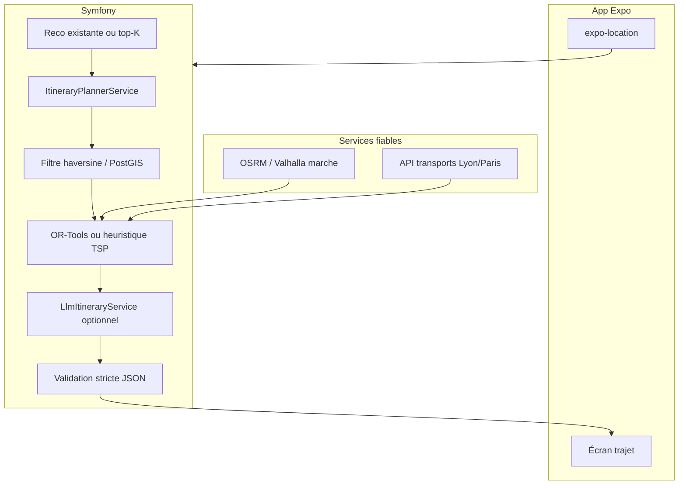

# Idées potentielles — LLM, trajets, forum & transports

> **Statut :** document de **vision / roadmap**, non implémenté (sauf mention contraire).  
> **Plans d’implémentation actifs :** [TODO_GAMIFICATION_BADGES.md](TODO_GAMIFICATION_BADGES.md) (badges, exploration, UX commentaires).  
> **Contexte LLM :** le service actuel (`LlmRankingService`) ne fait que du **re-ranking** sur `GET /api/recommendations`.  
> **Références :** [ARCHITECTURE.md](ARCHITECTURE.md), `odos-back/src/Service/LlmRankingService.php`, `Document copy/planllm.md`.

---

## 1. État actuel vs cible

| Existant aujourd’hui | Manquant pour les trajets |
|----------------------|---------------------------|
| `latitude` / `longitude` sur chaque `Activity` | Position **utilisateur** en temps réel (`expo-location` + consentement RGPD) |
| Recos via `LlmRankingService` + cache Redis | Endpoint dédié (ex. `POST /api/itineraries/plan`) |
| Carte MapLibre (pins activités) | API **transports** (GTFS, OSRM, TCL/IDFM, etc.) |
| `dateStart` / `dateEnd` sur activités | Contraintes horaires dans un solveur d’ordonnancement |

Le front ne lit pas encore le GPS utilisateur — seulement les coordonnées des activités.

---

## 2. Fine-tuning : quand ça vaut le coup

### 2.1 Re-ranking (cas actuel)

Fine-tuner un modèle type `qwen2.5:1.5b` sur Ollama peut améliorer un peu la pertinence du classement, mais :

- Coût GPU, pipeline de données, évaluation, re-déploiement à chaque nouveau modèle
- Gain souvent faible vs **prompt + JSON strict + cache** (déjà en place)
- Risque d’**halluciner des IDs** — la validation stricte côté PHP doit rester obligatoire

**Recommandation :** ne pas fine-tuner tout de suite. Collecter d’abord des signaux produit (clics reco, favoris, « j’y vais ») pour du supervised learning plus tard.

### 2.2 Création de trajets

Le fine-tuning est **souvent inadapté** pour :

- Distances réelles, temps de trajet, correspondances métro/bus
- Horaires d’ouverture (`dateStart` / `dateEnd`)
- Respect des lignes de transport

Ces contraintes sont **numériques et vérifiables** → APIs + algorithmes, pas un LLM seul.

Le LLM reste utile pour :

- Choisir entre **plusieurs itinéraires déjà valides** (« plus culturel », « moins de marche »)
- Rédiger un résumé court (« Matin : musée, déjeuner 12h30, après-midi parc »)
- Réordonner des **étapes pré-filtrées** (même pattern que les reco)

---

## 3. Architecture cible (hybride)



**Règle d’or (comme pour les reco) :** le LLM ne choisit que parmi des **étapes et modes de transport déjà calculés** par le backend.

---

## 4. Pipeline en 5 étapes

### 4.1 Candidats géographiques (sans LLM)

À partir de :

- Position user `(lat, lng)` — éphémère, pas stockée longtemps sans consentement
- Recos `GET /api/recommendations` (ou favoris)
- Rayon max (ex. 5–15 km) ou temps max (ex. 45 min à pied)

Filtre possible en PHP (haversine) ou PostGIS : tri par distance, limite ~30 candidats.

Enrichissement futur du payload LLM : `distance_km`, `eta_walk_min` (**calculés**, jamais inventés).

### 4.2 Matrice de temps réel (moteur transport)

| Besoin | Outil | Coût |
|--------|--------|------|
| Marche / vélo | [OSRM](https://project-osrm.org/) self-hosted ou Valhalla | Faible |
| Transports publics Lyon | GTFS TCL + [OpenTripPlanner](https://www.opentripplanner.org/) ou API tierce | Moyen |
| Multi-modal rapide | Google Directions / Mapbox Directions (clé API) | Variable |

Le backend obtient `duration(origin, dest, mode=walk|transit)` → matrice N×N pour N ≤ 10–12 arrêts.

### 4.3 Solveur d’ordonnancement (cœur « efficace »)

Problème : **TSP avec fenêtres de temps** (VRPTW simplifié).

- **Entrées :** stops = activités, durées sur place (60–90 min), créneaux `dateStart`/`dateEnd`, matrice de trajets
- **Sortie :** `ordered_stops[]` + `legs[]` (mode, durée, polyline optionnelle)

Outils possibles : **Google OR-Tools** (microservice Python) ou heuristique (plus proche voisin + 2-opt) en PHP si N reste petit.

**Pas de LLM à cette étape** — fiabilité et latence.

### 4.4 LLM en second passage (optionnel)

Nouveau service `LlmItineraryService`, calqué sur `LlmRankingService`.

**Entrée (JSON compact) :**

```json
{
  "user_interests": ["Music", "Nature"],
  "constraints": { "max_duration_min": 240, "budget_eur": 50 },
  "user_location": { "lat": 45.75, "lng": 4.85 },
  "feasible_itineraries": [
    {
      "id": "plan_a",
      "stops": [12, 34, 5],
      "total_travel_min": 38,
      "modes": ["walk", "metro", "walk"]
    }
  ]
}
```

**Sortie stricte :**

```json
{
  "chosen_plan_id": "plan_a",
  "ranked_plan_ids": ["plan_a", "plan_b"],
  "summary": "Parcours culturel de 4h autour de la Part-Dieu."
}
```

Validation backend : `chosen_plan_id` et `ranked_plan_ids` ⊆ plans fournis (comme `ranked_ids` ⊆ candidats).

### 4.5 Modèle plus capable (sans fine-tuning immédiat)

Évolution possible :

- `qwen2.5:7b` ou `mistral` en local (Ollama) — meilleur raisonnement, plus lent
- API managée (Mistral / OpenAI) **uniquement** sur l’endpoint trajets, avec rate limit + cache

Fine-tuning pertinent **après** 500–2000 exemples labelisés *(contexte → plan choisi par humains ou clics)*.

---

## 5. Fine-tuning (phase ultérieure)

### 5.1 Données à collecter

| Signal | Usage |
|--------|--------|
| Clic sur une reco | Pertinence relative |
| Favori + visite carte | Stop « souhaité » |
| Itinéraire accepté / abandonné | Label positif / négatif |
| Temps sur fiche activité | Proxy d’intérêt |

Exemple SFT :

```json
{
  "messages": [
    {"role": "system", "content": "Return only JSON with ranked_ids"},
    {"role": "user", "content": "{...candidates...}"},
    {"role": "assistant", "content": "{\"ranked_ids\":[3,1,7]}"}
  ]
}
```

### 5.2 Méthode pragmatique

1. **LoRA** sur Qwen2.5-7B-Instruct (Unsloth / MLX) — pas le 1.5B en prod CPU seule
2. **Évaluer** : NDCG@k, % IDs invalides, latence p95
3. **Comparer** à baseline : prompt actuel + modèle 7B **sans** fine-tune
4. Exporter GGUF → Ollama (`ollama create odos-ranker -f Modelfile`)

Souvent : **7B + bon prompt + cache** ≥ fine-tune 1.5B.

### 5.3 À ne pas fine-tuner

- Calcul d’itinéraire métro (GTFS évolue souvent)
- Géocodage, distances — APIs dédiées

---

## 6. Efficacité LLM (coût / latence)

| Technique | Application trajets |
|-----------|---------------------|
| Cache Redis | Clé `hash(user_id + lat_arrondi + interest_ids + jour)` — GPS arrondi ~100 m |
| Petit payload | Max 5–8 stops, descriptions ~80 car., pas de polyline complète dans le prompt |
| 2 appels max | Solveur → 2–3 plans → LLM choisit 1 |
| Timeout 2–3 s | Fallback : plan du solveur seul |
| `LLM_ENABLED` | Désactivable en prod si charge CPU |
| Modèles séparés | `odos-rank` (1.5B) vs `odos-itinerary` (7B) — profils Docker distincts |

---

## 7. Roadmap produit suggérée

### Phase A — Fondations (sans LLM)

1. `expo-location` + permission + envoi ponctuel au backend (pas de tracking continu sans opt-in)
2. `GET` ou `POST /api/itineraries/suggest` → solveur + OSRM marche
3. Affichage polyline sur MapLibre existant

### Phase B — Transports

4. Intégration GTFS / API TCL pour Lyon
5. Modes `walk | transit | mixed` dans les `legs`

### Phase C — LLM

6. `LlmItineraryService` : choix entre plans + texte court
7. Métriques + cache

### Phase D — Fine-tuning (optionnel)

8. Export logs anonymisés → dataset → LoRA si 7B + prompt plafonne

### Phase E — RGPD

- Finalité « planification de parcours » dans [RGPD_registre.md](RGPD_registre.md)
- Rétention GPS minimale
- Coordonnées **arrondies** envoyées au LLM si suffisant

---

## 8. Contrat API cible (exemple)

```http
POST /api/itineraries/plan
Authorization: Bearer …
Content-Type: application/json

{
  "origin": { "lat": 45.764, "lng": 4.835 },
  "duration_minutes": 180,
  "transport_preference": "transit",
  "activity_ids": null
}
```

Réponse indicative :

```json
{
  "plan_id": "uuid",
  "stops": [
    { "activity_id": 12, "arrival": "10:00", "stay_min": 60 },
    { "activity_id": 34, "arrival": "11:25", "stay_min": 45 }
  ],
  "legs": [
    { "from": "origin", "to": 12, "mode": "metro", "duration_min": 18, "line": "B" }
  ],
  "summary": "…",
  "source": "solver+llm"
}
```

---

## 9. Fichiers Symfony envisagés

| Fichier | Rôle |
|---------|------|
| `src/Service/ItineraryPlannerService.php` | Filtre géo + solveur + appels OSRM/GTFS |
| `src/Service/LlmItineraryService.php` | Choix narratif entre plans valides (optionnel) |
| `src/DTO/ItineraryStopForLlm.php` | Payload minimal pour le LLM |
| `src/State/ItineraryStateProvider.php` ou `Controller` | Point d’entrée API Platform |
| `config/services.yaml` | Paramètres `ITINERARY_*`, `LLM_ITINERARY_*` |

Réutiliser les patterns de `LlmRankingService` : validation stricte, cache, fallback, logs sans PII.

---

## 10. Synthèse

| Objectif | Approche recommandée |
|----------|----------------------|
| Recos plus pertinentes | Prompt + cache + modèle un peu plus gros ; fine-tune **plus tard** avec clics |
| Trajets fiables | **Solveur + APIs transport + géo** ; LLM = choix narratif entre plans valides |
| Étendre les capacités | Nouveau endpoint, pas étendre le prompt de `LlmRankingService` |
| Efficacité | Moins d’appels LLM, payloads petits, cache, fallback solveur |

Le fine-tuning a du sens avec **beaucoup de feedback utilisateur** et un modèle déjà cadré par validation stricte. Pour GPS + transports, prioriser **données structurées et moteurs externes** avant d’entraîner un modèle.

---

## 11. Espace forum communautaire — à juger

> **Statut : idée seule** — ne pas planifier en parallèle de la refonte commentaires (voir [TODO_GAMIFICATION_BADGES.md](TODO_GAMIFICATION_BADGES.md) phase E). À trancher après retours utilisateurs sur le fil par activité modernisé.

### Concept

Passer d’un **fil par activité** (avis/notes sous une fiche) à un **espace forum transversal** : sujets par ville, catégorie, ou « entraide locale », avec fils de discussion, réponses imbriquées, éventuellement modération renforcée.

### Intérêt potentiel

| Pour | Contre |
|------|--------|
| Communauté récurrente hors fiche activité | Modération, spam, charge admin |
| Contenus longs vs commentaire court | Risque de doublon avec commentaires existants |
| SEO / engagement si version web | RGPD, signalement, rétention contenu |

### Pistes techniques (si un jour validé)

- Nouvelles entités `ForumTopic`, `ForumPost` (distinct de `Comment` sur `Activity`)
- Rôles : auteur, modérateur admin, masquage, signalement
- API dédiée + écran(s) `app/forum/` — **ne pas fusionner** avec le composant commentaires activité
- Réutiliser `CommentContentSanitizer`, throttle, audit admin

### Questions produit à trancher avant dev

1. Forum **global** ou **par ville / région** uniquement ?
2. Lien avec badges (« contributeur », « top reviewer ») — cf. todo gamification ?
3. Anonymat partiel (alias) vs email visible modérateurs seulement ?
4. Priorité vs messagerie privée, trajets LLM, exploration carte ?

### Recommandation actuelle

**Reporter.** Livrer d’abord une **UX commentaires moderne sur fiche activité** (phase E du TODO). Mesurer l’usage (volume, récidive). Si besoin d’échanges longs et multi-sujets → prototyper forum en V2 avec spec modération dédiée.

---

*Dernière mise à jour : mai 2026.*
