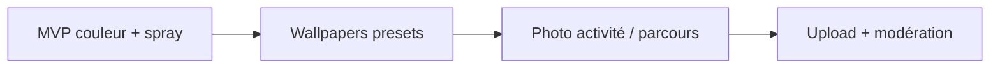

# Plan — fonds de conversation personnalisables & audit photo-first

Document de cadrage produit + technique pour ODOS.  
Objectif : permettre aux membres d'une **conversation à 2** ou d'un **groupe** de personnaliser le style du fil (dont le fond), et identifier les écrans/cartes encore trop « texte / gris » pour une app **photo-first**.

---

## Partie A — Personnalisation du style de conversation

### État actuel (juin 2026)

| Zone | Fichiers | Comportement |
|------|----------|--------------|
| Chat 1:1 | `odos-front/app/chat/[id].tsx` | Fond uni `colors.background` / `pop.paper` |
| Chat groupe | `odos-front/app/group-chat/[id].tsx` | Idem |
| Thème global | `context/ThemeContext.tsx`, `app/appearance.tsx` | Variante couleur, spray, mosaic pop — **pas par conversation** |
| API | `Conversation`, `ActivityGroup` (backend) | Aucun champ `background`, `theme`, `wallpaper` |
| Types mobile | `types/index.ts` (`ConversationItem`, `GroupMessageItem`) | Pas de métadonnées visuelles |

Les bulles, le composer et les pièces jointes sont **dupliqués** dans les deux écrans chat (pas de layout partagé). Point d'extension naturel : le conteneur `KeyboardAvoidingView` + extraction future d'un `ChatThreadLayout`.

---

### Principes produit

1. **Le fond ne doit pas nuire à la lisibilité** — overlay semi-opaque sur la zone messages si fond chargé.
2. **Décision collective pour les groupes** — seuls admin/créateur modifient le thème groupe (ou vote simple en V2).
3. **DM = accord mutuel implicite** — les deux participants voient le même fond ; celui qui ouvre les réglages propose un preset (l'autre peut réinitialiser).
4. **Respect accessibilité** — contraste bulles/texte vérifié ; option « fond sobre » ; `prefers-reduced-motion` pour animations de fond.
5. **Offline / perf** — presets bundlés en priorité ; images custom en cache local.

---

### Options possibles (menu utilisateur)

#### Niveau 1 — MVP rapide (1 sprint)

| Option | Description | DM | Groupe | Effort |
|--------|-------------|:--:|:------:|--------|
| **Couleur unie** | 8–12 teintes issues de la palette ODOS (pas le color picker libre) | ✅ | ✅ | Faible |
| **Motif spray** | Réutiliser `SprayBackground` + intensité (off / léger / moyen) | ✅ | ✅ | Faible |
| **Fond « papier »** | Texture légère mosaic pop (sans image) | ✅ | ✅ | Faible |
| **Réinitialiser** | Revenir au défaut global | ✅ | ✅ | Faible |

**UI proposée** : bouton « ⋯ » ou icône pinceau dans l'en-tête du fil → bottom sheet « Apparence de la conversation ».

#### Niveau 2 — Photo-first (2 sprints)

| Option | Description | DM | Groupe | Effort |
|--------|-------------|:--:|:------:|--------|
| **Wallpapers presets** | Pack 12–20 images (ville, sortie, carte, abstract) bundlées + servies par API | ✅ | ✅ | Moyen |
| **Wallpaper activité** | Fond = photo floutée d'une activité partagée dans le fil (dernière ou choisie) | ✅ | ✅ | Moyen |
| **Collage parcours** | Fond = mosaïque auto des covers des étapes d'un parcours lié au groupe | ❌ | ✅ | Moyen |
| **Opacité / flou** | Slider flou + assombrissement pour lisibilité | ✅ | ✅ | Faible |

#### Niveau 3 — Avancé (backlog)

| Option | Description | DM | Groupe | Effort |
|--------|-------------|:--:|:------:|--------|
| **Upload custom** | Image perso (modération + taille max) | ✅ | Admin only | Élevé |
| **Thème bulles** | Variantes bulles (coins, couleurs dérivées du fond) | ✅ | ✅ | Moyen |
| **Fond animé léger** | Parallax subtil ou gradient animé (désactivable) | ✅ | ✅ | Moyen |
| **Sync avec thème app** | « Utiliser mon thème Apparence » vs « thème de cette conv » | ✅ | ✅ | Faible |
| **Éphémère / saisonnier** | Wallpapers limités dans le temps (events, ville) | ✅ | ✅ | Faible |

---

### Modèle de données recommandé

#### Conversation (1:1)

```text
conversation_theme
  conversation_id (FK, unique)
  preset_id       varchar(64) nullable   -- ex: "ocean-mist", "spray-medium"
  wallpaper_url   varchar(512) nullable  -- custom ou CDN
  overlay_opacity float default 0.55
  blur_radius     int default 12
  updated_by_id   FK user
  updated_at      datetime
```

Alternative légère MVP : champ JSON `appearance` sur `conversation` :

```json
{
  "presetId": "spray-medium",
  "wallpaperUrl": null,
  "overlayOpacity": 0.5
}
```

#### Groupe

```text
activity_group.appearance JSON nullable  -- même schéma
```

Ou table dédiée `group_chat_theme` si historique / audit admin requis.

#### API

| Méthode | Route | Qui |
|---------|-------|-----|
| `GET` | `/api/chat/conversations/{id}` | inclure `appearance` |
| `PATCH` | `/api/chat/conversations/{id}/appearance` | participant |
| `GET` | `/api/groups/{id}` | inclure `appearance` |
| `PATCH` | `/api/groups/{id}/appearance` | admin/créateur |
| `GET` | `/api/chat/appearance-presets` | catalogue presets (public) |

#### Frontend

- Nouveau hook `useConversationAppearance(conversationId | groupId)`
- Composant `ConversationBackground` (ImageBackground / Spray / couleur + overlay)
- Refactor : `ChatThreadLayout` partagé entre `chat/[id]` et `group-chat/[id]`
- Cache TanStack Query + `expo-secure-store` pour wallpaper URI

---

### Phases de livraison suggérées



| Phase | Contenu | Dépendances |
|-------|---------|-------------|
| **P0** | Presets couleur + spray, sheet réglages, API PATCH | Migration JSON |
| **P1** | Pack wallpapers + opacité/flou | Assets design |
| **P2** | Fond depuis activité/parcours partagé | Données message déjà présentes |
| **P3** | Upload, modération admin, historique | Storage S3/uploads |

---

## Partie B — Carte des écrans « trop basiques » (audit photo-first)

Légende priorité : **H** = haute, **M** = moyenne, **L** = basse.

### Déjà solide (référence)

| Écran / composant | Fichier | Note |
|-------------------|---------|------|
| Carte carte (map) | `components/map/ActivityCard.tsx` | Hero 4:3 + gradient |
| Favoris | `components/FavoriteCard.tsx` | Portrait 4:5 |
| Mosaic pop | `components/cards/MosaicPopCard.tsx` | Photo-led quand `imageUrl` existe |
| Browse search | `app/(tabs)/search.tsx` | Hero / grid / banner |
| Détail activité | `app/activity/[id].tsx` | Full-width hero |

---

### Priorité HAUTE — manque photo évident

| # | Écran / carte | Fichier | Problème actuel | Piste photo-first |
|---|---------------|---------|-----------------|-------------------|
| H1 | Étapes parcours | `app/parcours/[id].tsx` | Liste texte + numéro, **aucune vignette activité** | Thumb 56×56 par étape, tap → fiche |
| H2 | Ligne reco accueil | `app/(tabs)/index.tsx` (`ActivityRow`) | Pastille ronde 76px, trop petite | Carte horizontale 4:3 ~120px ou row mosaic |
| H3 | Résultats recherche | `app/(tabs)/search.tsx` (`SearchResultRow`) | Thumb 52px rond | Rectangle 64×80 ou bandeau |
| H4 | Carte parcours | `components/social/ParcoursCard.tsx` | Cover 64px ou icône Route | Collage auto 2–4 photos d'étapes |
| H5 | Picker parcours | `components/social/ParcoursPickerSheet.tsx` | Icône seule | Mini-cover par parcours |
| H6 | PJ parcours (chat) | `components/social/MessageAttachmentCards.tsx` | `MessageParcoursCard` = icône | Utiliser `coverImageUrl` |
| H7 | Partages reçus | `app/(tabs)/community/friends.tsx` | Texte sender → activité, **pas de photo** | Thumb activité à gauche (comme favoris) |

---

### Priorité MOYENNE — polish & empty states

| # | Zone | Fichier | Problème | Piste |
|---|------|---------|----------|-------|
| M1 | Placeholders globaux | Cartes diverses | Bloc gris `surface` si pas d'image | Blur hash, illustration catégorie, collage ville |
| M2 | Skeletons | `components/ui/Skeleton.tsx` | Barres grises | Shimmer aux ratios photo (4:3, 4:5) |
| M3 | Empty reco / search | `index.tsx`, `search.tsx` | Texte + CTA | 3 cartes exemple / mood ville |
| M4 | Empty favoris | `app/(tabs)/favorites.tsx` | Icône cœur grise | Grille fantôme avec photos stock |
| M5 | Carte reco horizontale | `app/(tabs)/index.tsx` (`RecommendationCard`) | Placeholder teinté plat | Image ville ou activité fallback |
| M6 | Détail parcours header | `app/parcours/[id].tsx` | Icône si pas de cover | Collage étapes par défaut |
| M7 | Carte groupe | `components/social/GroupCard.tsx` | Texte seul | `avatarUrl` ou mosaic membres/activités |
| M8 | Demande d'ami | `components/social/FriendRequest.tsx` | Pas d'avatar | `UserAvatar` 44px |
| M9 | Profil public | `app/profile/[id].tsx` | Stats + avatar | Bandeau « lieux visités » (photos) |
| M10 | Map vide | `components/map/MapExperience.tsx` | Bannière texte | Carousel 3 activités à proximité |
| M11 | PJ activité chat | `MessageAttachmentCards.tsx` | Thumb 56px | Passer à 72–80px, coins arrondis blob |
| M12 | Teaser carte accueil | `components/cards/MosaicPopMap.tsx` | SVG décoratif | Mini mosaic photos réelles de la ville |

---

### Priorité BASSE — acceptable ou hors scope photo

| Zone | Fichier | Note |
|------|---------|------|
| Forum fils | `components/forum/ThreadCard.tsx` | Text-first par nature |
| Liste messages | `app/(tabs)/community/messages.tsx` | Avatar = identité |
| Amis | `components/social/FriendCard.tsx` | Avatar suffisant |
| Compte | `app/(tabs)/account.tsx` | Profil utilisateur |
| Badges profil | `components/badges/ProfileBadgesShowcase.tsx` | Déjà illustré si image badge |
| `RecommendedActivities.tsx` | `components/RecommendedActivities.tsx` | Composant legacy non branché — supprimer ou fusionner |

---

### Matrice visuelle (vue d'ensemble)

```
                    PHOTO PRÉSENTE          PHOTO ABSENTE / FAIBLE
                    ─────────────          ───────────────────────
Accueil             RecommendationCard     ActivityRow (H2)
Recherche           Hero/Grid/Banner       SearchResultRow (H3)
Parcours            [id] cover             Steps list (H1), ParcoursCard (H4)
Social              MessageActivityCard    Shares friends (H7), ParcoursCard msg (H6)
Chat                —                      Fond uni (Partie A)
Groupes             —                      GroupCard (M7)
```

---

## Partie C — Roadmap combinée recommandée

| Sprint | Conversation | Photo-first |
|--------|--------------|-------------|
| **S1** | P0 fond couleur + spray, API JSON, sheet réglages | H7 partages avec thumb, H6 parcours dans chat |
| **S2** | P1 wallpapers presets + overlay | H1 étapes parcours, H4 ParcoursCard collage |
| **S3** | Refactor `ChatThreadLayout` | H2 ActivityRow, H3 SearchResultRow, M1 placeholders |
| **S4** | P2 fond activité/parcours | M2 skeletons, M3–M5 empty states |
| **S5+** | P3 upload + modération | M6–M12 polish |

---

## Partie D — Checklist design (avant dev)

- [ ] Maquettes sheet « Apparence conversation » (DM + groupe)
- [ ] Pack 12 wallpapers + règles de crop (safe zone messages)
- [ ] Tokens `chatBackground`, `bubbleMine`, `bubbleTheirs` (optionnel)
- [ ] Grille vignettes parcours / partages (48–80px)
- [ ] Fallback catégorie (illustration par `category.slug`)
- [ ] Test contraste WCAG sur 3 fonds les plus chargés

---

## Références code

| Sujet | Chemin |
|-------|--------|
| Chat DM | `odos-front/app/chat/[id].tsx` |
| Chat groupe | `odos-front/app/group-chat/[id].tsx` |
| Spray global | `odos-front/components/ui/SprayBackground.tsx` |
| Thème app | `odos-front/app/appearance.tsx` |
| Entité conversation | `odos-back/src/Entity/Conversation.php` |
| Entité groupe | `odos-back/src/Entity/ActivityGroup.php` |
| Audit UX existant | `docs/AUDIT_UI_UX_FRONT.md` |
| DA gaps | `docs/DA_APP_GAP.md` |

---

*Dernière mise à jour : juin 2026 — à valider produit avant implémentation.*
