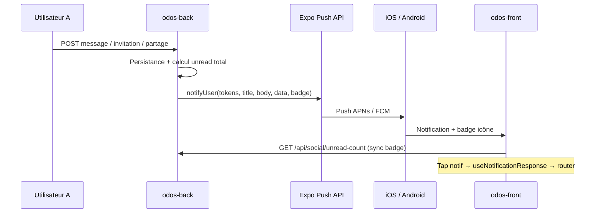

# Notifications push ODOS — guide de mise en place

Document opérationnel pour déployer et étendre le **système de notifications push** (messages, invitations, partages…) avec **badge sur l’icône** de l’app.

Complète : [ARCHITECTURE.md](ARCHITECTURE.md) · [DESIGN_JAKOB_FLOWS.md](DESIGN_JAKOB_FLOWS.md) §4.4 (consentements séparés) · [RGPD_registre.md](RGPD_registre.md).

**Dernière mise à jour :** juin 2026

---

## 1. Objectif produit

| Besoin utilisateur | Comportement attendu |
|--------------------|----------------------|
| Message privé reçu | Push + badge icône + badge onglet Communauté |
| Message de groupe | Idem, ouverture sur le fil groupe |
| Demande d’ami | Push → écran Amis / demandes |
| Invitation groupe | Push → `/group-invitations` |
| Activité partagée | Push → onglet Amis (partages) |
| App au premier plan | Bannière discrète ou mise à jour badge sans spam |
| Tap sur la notif | Navigation directe vers le bon écran |

**Principe Jakob :** même schéma que WhatsApp / Instagram — compteur sur l’icône = « il se passe quelque chose dans Social », tap = contexte immédiat.

---

## 2. État actuel du dépôt (juin 2026)

### ✅ Déjà en place

| Couche | Fichier / endpoint | Rôle |
|--------|-------------------|------|
| **Backend envoi** | `odos-back/src/Service/PushNotificationService.php` | POST Expo Push API (`exp.host`) |
| **Tokens** | `PushToken` entity, `PushTokenService`, `PushTokenController` | `POST/DELETE /api/me/push-token` |
| **Compteur non-lus API** | `GET /api/social/unread-count` | Agrège amis, messages, groupes, partages |
| **Front token** | `hooks/usePushNotifications.ts` | Permission + enregistrement token (après consentement social) |
| **Front routing tap** | `hooks/useNotificationResponse.ts` | Deep link au tap (cold start + background) |
| **Badge onglet** | `app/(tabs)/_layout.tsx` + `useSocialUnreadCount` | Badge React Navigation sur l’onglet Communauté |
| **Plugin Expo** | `app.json` → `expo-notifications` | Build natif requis |

### ✅ Implémenté (sprint S1 + quick wins S2 — juin 2026)

| Pièce | Où |
|-------|-----|
| **Badge icône OS** (`setBadgeCountAsync`) | `hooks/useAppIconBadge.ts`, monté dans `app/(tabs)/_layout.tsx` |
| **`badge` + `priority` + `channelId` dans payload Expo** | `PushNotificationService` (via `SocialUnreadCountService`) |
| **`SocialUnreadCountService` partagé** | `odos-back/src/Service/SocialUnreadCountService.php` (controller + push) |
| **Handler foreground** (`setNotificationHandler`) | `hooks/useNotificationResponse.ts` (bannière + son + badge) |
| **Canal Android `social`** (`setNotificationChannelAsync`) | `hooks/useNotificationResponse.ts` |
| **Routage `friend_request`** | `hooks/useNotificationResponse.ts` → `/(tabs)/community/friends` |
| **`unregisterPushToken` + reset badge au logout** | `context/AuthContext.tsx` |

### ⚠️ Manques restants

| Manque | Impact | Priorité |
|--------|--------|----------|
| **Préférences utilisateur** (opt-out par type) | RGPD / confort | **P2** |
| **Événements forum / badges** | Pas de push aujourd’hui | **P3** |

Le reste de ce document décrit **comment brancher ces pièces** sur l’existant.

---

## 3. Architecture



### Flux d’enregistrement du token

1. Utilisateur connecté **et** `socialConsentedAt` défini (`community/_layout.tsx`).
2. `usePushNotifications` demande la permission OS.
3. `Notifications.getExpoPushTokenAsync()` → token `ExponentPushToken[...]`.
4. `POST /api/me/push-token` `{ token, platform }`.
5. Stockage table `push_token` (1 token unique, réassignable si même appareil).

> **Important :** les push ne fonctionnent **pas** dans Expo Go pour les builds récents. Utiliser un **development build** ou un APK/AAB EAS (`pnpm build:apk:preview`).

---

## 4. Catalogue des événements push

### 4.1 Événements déjà émis (backend)

| `data.type` | Déclencheur | Service | Titre (ex.) | `data` utile |
|-------------|-------------|---------|-------------|--------------|
| `chat_message` | Nouveau message DM | `ChatService` | Nom expéditeur | `conversationId` |
| `group_message` | Message groupe | `GroupChatService` | `Groupe · Auteur` | `groupId` |
| `friend_request` | Demande d’ami | `FriendshipController` | Nouvelle demande d’ami | *(aucun id aujourd’hui)* |
| `group_invitation` | Invitation groupe | `GroupService` | Invitation groupe | `groupId` |
| `activity_share` | Partage activité | `SharedActivityService` | Activité partagée | `sharedActivityId` |

### 4.2 Routage front (`useNotificationResponse`)

| `data.type` | Route actuelle | À ajouter |
|-------------|----------------|-----------|
| `chat_message` | `/chat/{conversationId}` | — |
| `group_message` | `/group-chat/{groupId}` | — |
| `group_invitation` | `/group-invitations` | — |
| `activity_share` | `/(tabs)/community/friends` | Option : scroll vers le partage |
| `friend_request` | `/(tabs)/community/friends` ✅ | Option : query `?tab=requests` |

### 4.3 Événements candidats (backlog)

| Événement | Moment d’émission suggéré | `data.type` proposé |
|-----------|---------------------------|---------------------|
| Demande acceptée | `FriendshipService::accept` | `friend_accepted` |
| Co-édition parcours | `ParcoursService::addCollaborator` | `parcours_collab_invite` |
| Réponse forum (mention) | futur | `forum_reply` |
| Badge débloqué | `GamificationService` (opt-in) | `badge_unlocked` |
| Modération (contenu masqué) | admin action | `moderation` |

**Règle :** un événement métier = **un seul appel** à `PushNotificationService::notifyUser()` après `flush()` réussi.

---

## 5. Backend — envoyer et faire évoluer les push

### 5.1 Service central

```php
// odos-back/src/Service/PushNotificationService.php
$this->pushNotificationService->notifyUser(
    $recipient,
    'Titre court',
    'Corps lisible (≤ 120 car.)',
    [
        'type' => 'chat_message',
        'conversationId' => $conversation->getId(),
    ],
);
```

Expo reçoit un tableau de messages par token. Timeout 5 s, échec loggé en `warning` (pas de retry automatique aujourd’hui).

### 5.2 Ajouter le badge dans le payload (P0)

Enrichir `notifyUser` pour inclure le **total non-lus** du destinataire :

```php
// Exemple d’évolution PushNotificationService.php
$messages[] = [
    'to' => $token,
    'title' => $title,
    'body' => $body,
    'data' => $data,
    'sound' => 'default',
    'badge' => $unreadTotal,  // ← iOS : chiffre sur l’icône
    'channelId' => 'social',  // ← Android (après config plugin)
    'priority' => 'high',
];
```

**Calcul du badge :** réutiliser la même logique que `SocialUnreadCountController` :

```php
$total =
    $this->friendshipRepository->countPendingReceived($user)
    + $this->sharedActivityService->countUnread($user)
    + $this->groupInvitationRepository->countPendingForUser($user)
    + $this->chatMessageRepository->countUnreadForUser($user)
    + $this->groupMessageRepository->countUnreadForUser($user);
```

Extraire ce calcul dans un `SocialUnreadCountService` partagé entre le controller et `PushNotificationService` pour éviter la duplication.

### 5.3 Ajouter un nouvel événement (checklist)

1. Identifier le **service** après `flush()` (message créé, invitation persistée…).
2. Résoudre le **destinataire** (`User`).
3. Ne pas notifier l’**auteur** de l’action.
4. Appeler `notifyUser` avec `type` stable (contrat front).
5. Ajouter le **routage** dans `useNotificationResponse.ts`.
6. Vérifier que l’écran cible **marque comme lu** (invalidation `SOCIAL_UNREAD_QUERY_KEY`).
7. Test unitaire backend (mock HTTP client, voir `CreatesPushNotificationService`).

### 5.4 API tokens

| Méthode | Route | Corps |
|---------|-------|-------|
| `POST` | `/api/me/push-token` | `{ "token": "ExponentPushToken[...]", "platform": "ios" \| "android" }` |
| `DELETE` | `/api/me/push-token` | `{ "token": "..." }` |

Throttle : `UserActionThrottleService::assertCanRegisterPushToken`.

---

## 6. Frontend — permissions, badge icône, sync

### 6.1 Où c’est branché aujourd’hui

| Fichier | Rôle |
|---------|------|
| `app/(tabs)/community/_layout.tsx` | `usePushNotifications()` après consentement social |
| `app/_layout.tsx` | `useNotificationResponse()` (racine) |
| `app/(tabs)/_layout.tsx` | Badge onglet via `unread.total` |

### 6.2 Handler global (à ajouter dans `app/_layout.tsx`)

Configurer **une fois** au démarrage :

```typescript
import * as Notifications from 'expo-notifications';

Notifications.setNotificationHandler({
  handleNotification: async () => ({
    shouldShowAlert: true,
    shouldPlaySound: true,
    shouldSetBadge: true, // laisse l’OS appliquer data.badge si présent
  }),
});
```

En **foreground**, préférer une bannière légère plutôt qu’une alerte modale (Jakob : ne pas interrompre la lecture d’une fiche activité).

### 6.3 Badge sur l’icône (P0)

Créer `hooks/useAppIconBadge.ts` :

```typescript
import { useEffect } from 'react';
import { Platform } from 'react-native';
import { useSocialUnreadCount } from '@/hooks/useSocialUnreadCount';

export function useAppIconBadge() {
  const { data } = useSocialUnreadCount();

  useEffect(() => {
    if (Platform.OS === 'web') return;
    (async () => {
      const Notifications = await import('expo-notifications');
      const count = data?.total ?? 0;
      await Notifications.setBadgeCountAsync(count);
    })();
  }, [data?.total]);
}
```

Monter le hook dans `app/(tabs)/_layout.tsx` (utilisateur connecté + social consent).

**Quand remettre à zéro :**

- À l’ouverture d’un chat / groupe / liste d’invitations (après marquage lu côté API).
- Au logout : `setBadgeCountAsync(0)` + `unregisterPushToken`.

### 6.4 Sync après lecture

Déjà partiellement fait : les hooks social invalident `SOCIAL_UNREAD_QUERY_KEY` après actions (amis, groupes, chat).

Vérifier que chaque écran qui **consomme** les non-lus appelle l’API « mark read » correspondante :

| Écran | Action attendue |
|-------|-----------------|
| `chat/[id].tsx` | Marquer conversation lue à l’ouverture |
| `group-chat/[id].tsx` | Idem groupe |
| `community/friends.tsx` | Accepter / voir partages → `seenAt` |
| `group-invitations.tsx` | Traiter invitation |

Sans ça, le badge icône reste faux même si l’utilisateur a tout lu in-app.

### 6.5 Logout — désenregistrer le token

Dans `AuthContext` ou `AuthService.logout` :

```typescript
const token = (await Notifications.getExpoPushTokenAsync()).data;
if (token) await unregisterPushToken(token);
await Notifications.setBadgeCountAsync(0);
```

### 6.6 Étendre le routage des taps

Dans `hooks/useNotificationResponse.ts` :

```typescript
case 'friend_request':
  router.push('/(tabs)/community/friends');
  break;
```

Enrichir le payload backend si besoin : `{ type: 'friend_request', friendshipId: 42 }`.

---

## 7. Build natif & credentials (EAS)

### 7.1 Prérequis

| Plateforme | Prérequis |
|------------|-----------|
| **iOS** | Compte Apple Developer, certificat APNs via EAS |
| **Android** | Projet Firebase + clé FCM uploadée sur Expo |
| **Commun** | `extra.eas.projectId` dans `app.json` (déjà présent) |

### 7.2 Commandes utiles

```bash
cd odos-front

# Dev build (notifications réelles)
eas build --profile development --platform android

# Preview APK (test push sur device)
pnpm build:apk:preview

# Credentials
eas credentials
```

### 7.3 Plugin `expo-notifications` (Android)

Ajouter dans `app.json` si canal dédié :

```json
[
  "expo-notifications",
  {
    "icon": "./assets/images/notification-icon.png",
    "color": "#F4A261",
    "defaultChannel": "social"
  }
]
```

Couleur `#F4A261` = `orange.primary` ([DESIGN_DIRECTION.md](DESIGN_DIRECTION.md)).

### 7.4 Variables d’environnement

Aucune clé secrète côté app : Expo Push Token + API Expo publique.

En **prod**, s’assurer que `EXPO_PUBLIC_API_URL` pointe vers l’API HTTPS pour l’enregistrement du token.

---

## 8. Consentements & RGPD

Ordre recommandé (Jakob §4.4 — **ne pas tout demander en même temps**) :

```text
1. Connexion / inscription
2. Centres d’intérêt + ville
3. Consentement social (modal Communauté)     ← gate actuel push
4. Permission notifications OS (juste après)  ← moment optimal
5. (Plus tard) GPS exploration carte
```

| Traitement | Base légale | Mention registre |
|------------|-------------|------------------|
| Token push (device) | Exécution du contrat / intérêt légitime social | À documenter dans `RGPD_registre.md` |
| Contenu des notifs (pseudo, extrait message) | Même finalité que la messagerie | Durée = vie du token ou logout |

**Bonnes pratiques :**

- Pas de push marketing sans opt-in séparé.
- Supprimer les tokens à la **suppression de compte** (cascade `push_token` via FK user).
- Corps de notif : pas de données sensibles (email, coordonnées précises).

---

## 9. Tests & debug

### 9.1 Test manuel (device physique)

1. Build EAS preview / dev sur téléphone.
2. Se connecter, accepter consentement social, accepter notifications OS.
3. Vérifier en BDD : `SELECT * FROM push_token WHERE user_id = ?`.
4. Depuis un **second compte**, envoyer un message.
5. Vérifier : push reçue, tap → bon écran, badge onglet + icône.

### 9.2 Outil Expo Push

[expo.dev/notifications](https://expo.dev/notifications) — envoyer une notif de test avec le token copié depuis les logs.

Payload minimal :

```json
{
  "to": "ExponentPushToken[xxxx]",
  "title": "Test ODOS",
  "body": "Hello",
  "data": { "type": "chat_message", "conversationId": 1 },
  "badge": 3
}
```

### 9.3 Tests automatisés backend

Pattern existant : `tests/Support/CreatesPushNotificationService.php` — mock `HttpClientInterface`, assert URL `exp.host` et JSON.

### 9.4 Dépannage courant

| Symptôme | Cause probable |
|----------|----------------|
| Pas de token enregistré | Simulateur, Expo Go, pas de consentement social, permission refusée |
| Push non reçue | Token expiré, mauvais `projectId`, credentials EAS manquants |
| Tap sans navigation | `data.type` inconnu ou id manquant dans `useNotificationResponse` |
| Badge icône figé | `setBadgeCountAsync` non appelé ou non-lus API pas invalidée |
| Badge onglet OK, pas icône | Normal aujourd’hui — implémenter §6.3 |

---

## 10. Plan d’implémentation recommandé

| Sprint | Tâches | Definition of done | Statut |
|--------|--------|-------------------|--------|
| **S1 — Badge & sync** | `SocialUnreadCountService`, `badge` dans push payload, `useAppIconBadge`, logout unregister | Chiffre icône = `GET /api/social/unread-count`.total | ✅ fait |
| **S2 — Finition UX** | `setNotificationHandler`, routage `friend_request`, canal Android | Tap chaque type → bon écran ; foreground raisonnable | ✅ fait |
| **S3 — Préférences** | Toggle Paramètres « Notifications messages / invitations » | Respect opt-out côté `notifyUser` | ⏳ à faire |
| **S4 — Extension** | Push forum, badges (opt-in) | Catalogue §4.3 | ⏳ à faire |

---

## 11. Références code

| Sujet | Chemin |
|-------|--------|
| Envoi push | `odos-back/src/Service/PushNotificationService.php` |
| Tokens | `odos-back/src/Controller/PushTokenController.php` |
| Compteur non-lus | `odos-back/src/Controller/SocialUnreadCountController.php` |
| Enregistrement token | `odos-front/hooks/usePushNotifications.ts` |
| Routing tap | `odos-front/hooks/useNotificationResponse.ts` |
| Badge onglet | `odos-front/app/(tabs)/_layout.tsx` |
| API client | `odos-front/scripts/api.ts` (`registerPushToken`) |
| Types | `odos-front/types/index.ts` (`SocialUnreadCount`) |
| Consentement social | `odos-front/app/(tabs)/community/_layout.tsx` |

---

## 12. Contrat `data` (version 1)

À respecter pour toute nouvelle notification :

```typescript
type PushData = {
  type:
    | 'chat_message'
    | 'group_message'
    | 'friend_request'
    | 'group_invitation'
    | 'activity_share';
  conversationId?: number;
  groupId?: number;
  sharedActivityId?: number;
  friendshipId?: number;
};
```

Toute évolution = **versionner** (`data.schemaVersion: 2`) ou ajouter des champs optionnels sans casser les apps en prod.

---

*Pour indexer ce doc : entrée ajoutée dans [docs/README.md](README.md).*
