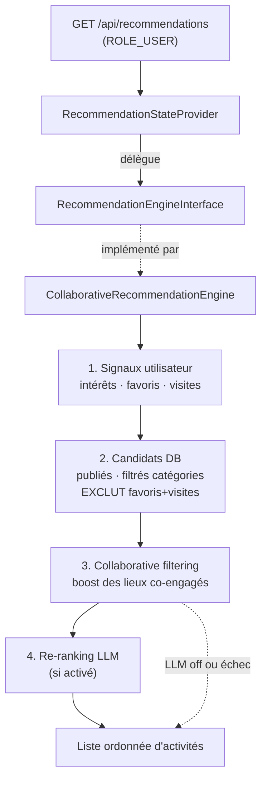

# Algorithme de recommandation & LLM — ODOS

> Document de référence : tout ce qu'il faut pour comprendre, régler et faire
> évoluer le moteur de recommandation d'activités et son re-ranking par LLM.
>
> Dernière mise à jour : 2026-06-07.

---

## 1. Vue d'ensemble

L'endpoint `GET /api/recommendations` renvoie une liste d'activités personnalisées
pour l'utilisateur connecté. Le calcul combine **deux familles de signaux** :

| Famille | Signal | Source |
|--------|--------|--------|
| **Content-based** | Catégories d'intérêt déclarées | `User.interests` |
| **Collaborative filtering** | Favoris + visites croisés entre utilisateurs | `User.favorites`, `User.visitedActivities` |

Puis un **LLM** (optionnel) ré-ordonne le tout pour un classement plus fin.



---

## 2. Architecture & responsabilités

La logique est **isolée derrière une interface** : la couche API ne connaît que
le contrat, pas l'algorithme. Changer/A-B tester l'algo = réaliaser l'interface
dans la config, sans toucher au reste.

| Rôle | Fichier | Responsabilité |
|------|---------|----------------|
| Endpoint / câblage | [../src/Entity/Activity.php](../src/Entity/Activity.php) | `#[ApiResource(uriTemplate: '/recommendations', provider: …)]` |
| Adaptateur API | [../src/State/RecommendationStateProvider.php](../src/State/RecommendationStateProvider.php) | Résout l'utilisateur, **délègue** au moteur. Aucune logique d'algo. |
| Contrat | [../src/Recommendation/RecommendationEngineInterface.php](../src/Recommendation/RecommendationEngineInterface.php) | `recommend(User): Activity[]` |
| **Moteur (politique)** | [../src/Recommendation/CollaborativeRecommendationEngine.php](../src/Recommendation/CollaborativeRecommendationEngine.php) | Orchestration : signaux, exclusion, boost CF, cache, appel LLM. |
| Accès données | [../src/Repository/ActivityRepository.php](../src/Repository/ActivityRepository.php) | Requêtes candidats + collaborative filtering (SQL). |
| Re-ranking LLM | [../src/Service/LlmRankingService.php](../src/Service/LlmRankingService.php) | Appel Ollama, parsing, cache, repli. |
| Config | [../config/services.yaml](../config/services.yaml) | Paramètres `app.reco.*` / `app.llm.*` + alias interface→implémentation. |
| Tests | [../tests/CollaborativeRecommendationEngineTest.php](../tests/CollaborativeRecommendationEngineTest.php), [../tests/RecommendationTest.php](../tests/RecommendationTest.php) | Moteur (sans DB) + service LLM. |

**Principe clé** : la *politique* (poids, exclusion, ordre) vit dans le moteur ;
l'*accès aux données* dans le repository ; l'*intégration LLM* dans son service.
Chaque couche est remplaçable indépendamment.

---

## 3. Le pipeline en détail

Tout se passe dans `CollaborativeRecommendationEngine::recommend(User $user)`.

### Étape 1 — Collecte des signaux

```
visitedIds  = IDs des activités visitées      (User.visitedActivities)
favoriteIds = IDs des activités favorites     (User.favorites)
knownIds    = visitedIds ∪ favoriteIds        (« lieux déjà connus »)
categoryIds = IDs des catégories d'intérêt    (User.interests)
```

`knownIds` joue **un double rôle** : graine du goût (pour le CF) **et** filtre
d'exclusion (on ne recommande pas ce que l'utilisateur connaît déjà).

### Étape 2 — Candidats DB

`ActivityRepository::findRecommendationCandidates(categoryIds, knownIds)` :

- `isPublished = true`
- si `categoryIds` non vide → filtre `category IN (categoryIds)`
  (sinon : toutes catégories — cas d'un utilisateur sans intérêts déclarés)
- `id NOT IN (knownIds)` → **exclut favoris + visites**
- tri par défaut `id DESC` (les plus récentes d'abord)

### Étape 3 — Collaborative filtering (boost des co-engagés)

`ActivityRepository::findCoEngagedActivityIds(userId, seed, exclude, wVisit, wFav, limit)`
implémente un **collaborative filtering item-based** :

1. **Voisins** = autres utilisateurs ayant *favorisé OU visité* au moins un des
   lieux de référence (`seed = knownIds`). Hors utilisateur courant.
2. **Score** de chaque activité candidate = engagement des voisins, pondéré :

   ```
   score(activité) = (nb de voisins l'ayant visitée)  × RECO_VISIT_WEIGHT
                   + (nb de voisins l'ayant favorisée) × RECO_FAVORITE_WEIGHT
   ```

3. Tri décroissant, on garde les `limit` premiers.

> 💡 « Les utilisateurs qui ont aimé / visité les mêmes lieux que vous ont aussi
> aimé / visité ceux-ci. » Une **visite réelle pèse plus** qu'un favori (preuve
> d'expérience vs. simple intention) → `RECO_VISIT_WEIGHT (2.0) > RECO_FAVORITE_WEIGHT (1.0)`.

Le moteur **remonte ces co-engagés en tête** de la liste de candidats, le reste
suit dans l'ordre DB initial (`boostCoEngaged()`).

### Étape 4 — Re-ranking LLM

La liste pré-ordonnée passe à `LlmRankingService::rank(interestNames, candidates, cacheKey)`.
Voir [§5](#5-le-llm-re-ranking).

> Si le LLM est désactivé **ou** échoue, l'ordre issu du collaborative filtering
> sert de repli — le résultat reste pertinent en toutes circonstances.

---

## 4. Données & modèle

```
User ────< user_favorite_activity >──── Activity     (favoris)
User ────< user_visited_activity  >──── Activity     (« J'ai visité »)
User ────< user_interest (catégories) ── Category    (intérêts déclarés)
```

| Relation | Entité | Table de liaison | Migration |
|----------|--------|------------------|-----------|
| Favoris | `User.favorites` ⇄ `Activity.favoritedBy` | `user_favorite_activity` | `Version20260317142626` |
| Visites | `User.visitedActivities` ⇄ `Activity.visitedBy` | `user_visited_activity` | `Version20260607130000` |

Les deux signaux sont alimentés par des endpoints dédiés (toggle on/off) :

| Action | Endpoint | Contrôleur |
|--------|----------|------------|
| Favori | `POST`/`DELETE /api/activities/{id}/favorite` | [../src/Controller/FavoriteActivityController.php](../src/Controller/FavoriteActivityController.php) |
| Visite | `POST`/`DELETE /api/activities/{id}/visited` | [../src/Controller/VisitedActivityController.php](../src/Controller/VisitedActivityController.php) |

Les deux sont exposés dans `GET /api/me` (champs `favorites` et `visitedActivities`).

---

## 5. Le LLM (re-ranking)

### Rôle

Le LLM **ne génère rien** : il **ré-ordonne** des candidats déjà sélectionnés par
la DB + le CF. Il reçoit les intérêts de l'utilisateur et une liste de candidats,
et renvoie un ordre de pertinence.

### Fonctionnement (`LlmRankingService`)

1. Si `LLM_ENABLED=false` ou aucun candidat → renvoie `array_slice(candidats, 0, top_k)` (court-circuit).
2. Tronque les candidats à `LLM_CANDIDATE_MAX` et construit des DTO légers
   (`id`, nom, description tronquée à 120 car., catégorie, ville, note, nb d'avis).
3. Appelle l'API **Ollama** (`POST {LLM_BASE_URL}/api/chat`, `format: json`, `stream: false`)
   avec un *system prompt* strict :

   ```
   You are a recommendation re-ranking engine. Reorder the candidate IDs by
   relevance to the user's interests. Return ONLY {"ranked_ids": [id1, id2, ...]}.
   Use ONLY provided IDs. At most {top_k}. Most relevant first.
   ```

4. **Validations de sécurité** : on ne conserve que des IDs présents dans les
   candidats (le LLM ne peut pas inventer ni injecter d'activités), puis on limite à `top_k`.
5. `reorder()` : applique l'ordre du LLM, puis **complète** avec les candidats
   non cités (jamais de perte de candidat).
6. **Repli** : toute exception (timeout, JSON invalide, IDs incohérents) →
   `array_slice(candidats, 0, top_k)`. L'utilisateur a toujours une réponse.

### Cache

Le résultat du LLM est **mis en cache** (Redis via `cache.app`) sous une clé
calculée par le moteur :

```
cacheKey = sha256( userId : "catégories triées" : "k" : "lieux connus triés" )
```

→ La clé intègre **intérêts + favoris + visites**. Dès que l'un change, le cache
est naturellement contourné (nouvelle clé) ; sinon on sert le classement caché
pendant `LLM_CACHE_TTL_SECONDS`. Cela évite de rappeler le LLM à chaque requête.

---

## 6. Configuration

### Collaborative filtering — `app.reco.*`

Définis dans [../config/services.yaml](../config/services.yaml), surchargeable par variables d'environnement
(valeurs par défaut dans [../.env.example](../.env.example)) **sans redéploiement** :

| Variable d'env | Défaut | Effet |
|----------------|--------|-------|
| `RECO_VISIT_WEIGHT` | `2.0` | Poids d'une visite d'un voisin dans le score CF |
| `RECO_FAVORITE_WEIGHT` | `1.0` | Poids d'un favori d'un voisin dans le score CF |
| `RECO_CANDIDATE_LIMIT` | `50` | Taille max du pool de co-engagés remonté par le CF |

### LLM — `app.llm.*`

| Variable d'env | Défaut (ex.) | Effet |
|----------------|--------------|-------|
| `LLM_ENABLED` | `true` | Active/désactive le re-ranking LLM |
| `LLM_BASE_URL` | `http://llm:11434` | URL du serveur Ollama |
| `LLM_MODEL` | `qwen2.5:1.5b` | Modèle utilisé |
| `LLM_TIMEOUT` | `3` | Timeout (s) — court pour ne pas bloquer l'API |
| `LLM_TOP_K` | `15` | Nombre max d'activités renvoyées |
| `LLM_CANDIDATE_MAX` | `20` | Nombre max de candidats envoyés au LLM |
| `LLM_CACHE_TTL_SECONDS` | `1800` | Durée de cache du classement LLM |

---

## 7. Cache côté front & rafraîchissement

Les recommandations sont mises en cache par TanStack Query côté mobile
(`queryKey: ['recommendations', userId, interests]`).

Quand un signal change, le front **invalide** `['recommendations']` pour forcer un
recalcul :

- Toggle **favori** → invalide `['favoriteIds']` + `['recommendations']`
- Toggle **visite** → invalide `['visitedIds']` + `['recommendations']`

Voir [../../odos-front/app/activity/[id].tsx](../../odos-front/app/activity/%5Bid%5D.tsx).

---

## 8. Robustesse (cas limites gérés)

| Situation | Comportement |
|-----------|--------------|
| Utilisateur non connecté | Le provider renvoie `[]` |
| Aucun intérêt déclaré | Candidats toutes catégories (pas de filtre) |
| Aucun favori ni visite | Pas de graine → **le CF n'est pas sollicité**, on garde l'ordre DB |
| Aucun voisin trouvé | CF renvoie `[]` → ordre DB conservé |
| LLM désactivé | Court-circuit, ordre CF/DB tronqué à `top_k` |
| LLM en échec (timeout, JSON KO) | Repli sur l'ordre CF/DB |
| LLM renvoie des IDs inconnus/inventés | Filtrés, jamais injectés dans le résultat |
| `userId` null (entité non persistée) | Pas de boost CF, `cacheKey = null` (pas de cache) |

---

## 9. Tester

```bash
# Tous les tests reco (sans DB)
docker compose exec php php bin/console # (ou en local)
php vendor/bin/phpunit tests/CollaborativeRecommendationEngineTest.php tests/RecommendationTest.php

# Analyse statique (niveau 7)
php vendor/bin/phpstan analyse src/Recommendation --level=7
```

Le moteur est **testable sans base de données** : le repository est mocké (il
renvoie des tableaux), le LLM est instancié réel mais désactivé (il se contente
de tronquer). On vérifie ainsi exclusion, boosting CF et repli de façon déterministe.

---

## 10. Faire évoluer l'algorithme

### Régler les poids
Modifier `RECO_VISIT_WEIGHT` / `RECO_FAVORITE_WEIGHT` (env) → effet immédiat au
prochain démarrage, sans toucher au code.

### Remplacer / A-B tester l'algorithme
1. Créer une nouvelle classe implémentant `RecommendationEngineInterface`
   (ex. `MlRecommendationEngine`, `PopularityRecommendationEngine`).
2. Réaliaser l'interface dans [../config/services.yaml](../config/services.yaml) :
   ```yaml
   App\Recommendation\RecommendationEngineInterface: '@App\Recommendation\MlRecommendationEngine'
   ```
3. Rien d'autre à changer : le provider, l'endpoint et le front sont inchangés.

### Pistes d'amélioration futures
- **Injecter le signal de co-engagement dans le prompt LLM** (et pas seulement
  via l'ordre des candidats) pour un re-ranking encore plus fin.
- **Filtrage géographique** des candidats (rayon autour de l'utilisateur).
- **Décote temporelle** : pondérer les visites récentes plus fort que les anciennes
  (la table `user_visited_activity` ne date pas encore les visites — à ajouter).
- **Diversité** : éviter de saturer le top avec une seule catégorie.
```
